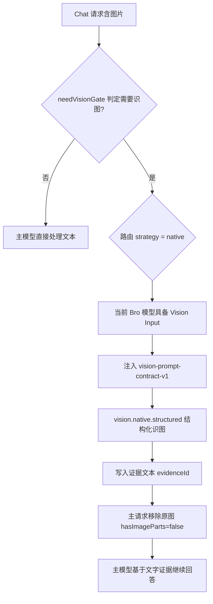
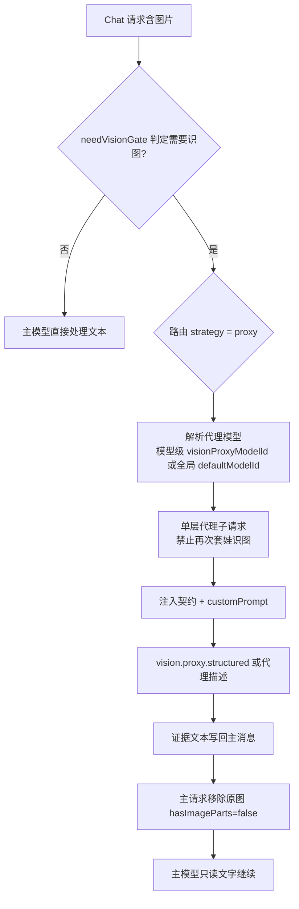
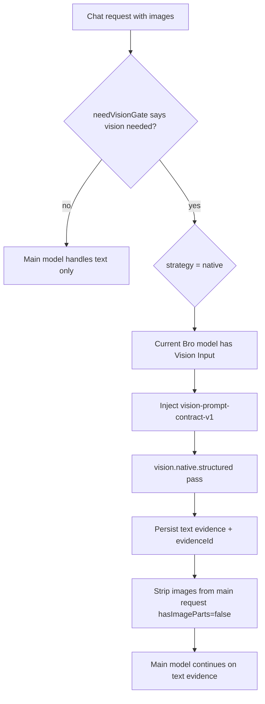
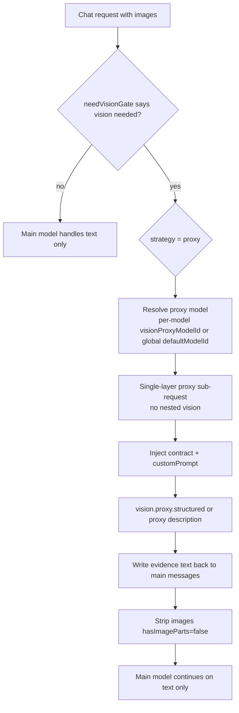

# Copilot Bro

<!-- This README is generated by scripts/readme/generate-readme.mjs from docs/readme.config.json and docs/readme.sections.json. Do not edit README.md directly; edit the config/sections sources and run npm run readme:generate. -->

**语言 / Language：** [中文](#中文) | [English](#english)**

## 中文

把 DeepSeek、智谱 / Z.AI GLM、MiniMax、Kimi、Qwen 以及任意 OpenAI-compatible 模型接入 VS Code / GitHub Copilot Chat 的模型选择器。

本扩展基于 VS Code `LanguageModelChatProvider` API 工作。它让 Copilot Chat、Edit、Agent 等聊天场景可以选择你自己的模型，但不会替代 Copilot 原生内联补全、仓库索引、意图识别等后台服务。

### 功能概览

**多供应商模型（BYOK）**

- 内置 DeepSeek、智谱 GLM、MiniMax、Kimi/Moonshot、Qwen/DashScope；支持自定义 OpenAI 兼容供应商与模型。
- 模型出现在 Copilot Chat 选择器中，可用于 Chat / Edit / Agent、工具调用与 MCP。
- 图形化「供应商 + 模型」三栏编辑器：保存 API Key、覆盖温度/上下文/视觉/工具等参数。

**识图能力（重点）**

- **自带视觉的模型**：在扩展内完成**高保真结构化识图**（`vision-prompt-contract-v1` + 文字证据），主请求不再携带原图（`strategy: native`）。详见 [高保真识图流程](#高保真识图流程)。
- **不带视觉的模型**：可启用**识图代理**，由另一视觉模型先描述图片，主模型只读文字（`strategy: proxy`）。
- 全局与**按模型**配置代理；关闭全局代理时，Bro 视觉模型仍默认走 native。
- 单层代理、防套娃：代理子请求不会再次触发识图编排。
- **说明**：当前用户可见的「高保真」指结构化描述与证据链；整页栅格→SVG 还原后处理链在代码中暂停开放（设置页不展示 `rasterVectorize` 等还原专用项）。

**其它**

- Thinking / reasoning 流式展示与多轮回放。
- 预设提示词 `*.copilot-bro.prompt.md`。
- API Key 仅存本机 SecretStorage。

### 高保真识图流程

下列流程图描述**当前对用户开放**的结构化识图路径。无论 native 还是 proxy，成功后的主请求都会用**文字证据**替换图片附件（`hasImageParts: false`），并注入 `vision-prompt-contract-v1` 要求的字段组。

### 何时走哪条路？

| 条件 | 典型 strategy | 说明 |
| --- | --- | --- |
| 模型勾选 **Vision Input**，且模型级 **Vision Proxy** 为「禁用」或留空且不需要代理 | `native` | 当前 Bro 视觉模型自己做结构化 pass |
| 模型未勾选 Vision Input，或模型级/全局指定了代理模型 | `proxy` | 图片只发给代理模型，主模型读文字 |
| 内置 `(... Wrapped)` 模型（Path B） | `wrapper-proxy` / `native` 等 | 由兼容矩阵决定，见下文「兼容矩阵」 |
| `visionAgent.enabled = false` | 回退简化代理 | 紧急回滚开关，跳过会话调度 |

### 不走代理（native 结构化识图）



日志关键字：`vision.native.structured.resolving` / `vision.native.structured.resolved`。

### 走代理（proxy 识图）



日志关键字：`vision.proxy` 相关事件；全局 `visionProxy.enabled = false` 时，**无视觉**模型不再走代理，但 **Bro 视觉模型仍可 native**。

### 两条路径的共同点

- 都会经过完整性校验（`visionIntegrity`，可配置严格模式）。
- 都可受 `visionAgent` 会话调度（批大小、去重、重试）影响。
- Chat 里的 `[Vision]` 进度条仅受 `chatDebugVisibility` 控制，不影响实际识图逻辑。
- **未对用户开放**：栅格矢量化、整页 SSIM 还原、占位 SVG 交付等后处理（代码中 `HIGH_FIDELITY_RESTORE_IMAGE_PIPELINE_SUSPENDED`）。

### 📦 内置供应商

扩展内置以下官方 OpenAI-compatible 供应商预设。保存供应商 API Key 后，扩展会尝试调用该供应商的 `/models` 接口刷新远端模型列表；失败时保留内置预设或上次缓存，不影响启动：

- DeepSeek：`deepseek-v4-pro`、`deepseek-v4-flash`
- 智谱 / Z.AI：`glm-5.1`、`glm-5v-turbo`、`glm-4.6v`、`glm-4.5v`、`glm-4.6`、`glm-4.5`、GLM 4 系列
- MiniMax：`MiniMax-M2.7`、`MiniMax-M2.5`、`MiniMax-M2.1`、`MiniMax-M2`
- Kimi / Moonshot：`kimi-k2.6`、`kimi-k2.5`、Moonshot V1 文本与视觉模型
- Qwen / DashScope：Qwen commercial、coder、QwQ、math、open-source 系列

你在本地保存过的模型参数会作为 override 合并到最新预设或远端模型列表上。也就是说，供应商新增模型时你能看到新模型；你改过的温度、输出长度、thinking 等参数不会被覆盖。只有当供应商模型 ID 被替换或删除时，旧模型才会作为你的本地自定义配置继续保留。

### 🚀 快速开始

1. 安装扩展，要求 VS Code `1.104.0` 或更高版本。
2. 打开命令面板，运行 `Copilot Bro: Open Model Settings`。
3. 在设置页中选择供应商和模型，按需调整参数，点击 `Save Local Model Override`。
4. 运行 `Copilot Bro: Set Provider API Key`。
5. 选择供应商，例如 `deepseek`、`zhipu`、`kimi`、`qwen`。
6. 输入 API Key。供应商名前出现 `✓` 表示本机已保存 key。
7. 打开 Copilot Chat 的模型选择器，进入 `Manage Models`，启用 `Copilot Bro` 下的模型。
8. 回到聊天框选择模型并开始使用。

> 本扩展使用 VS Code `1.104.0` 起可用的稳定 `LanguageModelChatProvider` API，不再需要 `--enable-proposed-api`。
> 在稳定 API 下，扩展无法完全复用 Copilot 内置模型的官方 thinking UI。本扩展会优先使用可用的 VS Code thinking part；不可用时会把 DeepSeek reasoning 渲染为可折叠 Markdown 思考块，并附带隐藏元数据，以便下一轮请求还原 DeepSeek 要求的 `reasoning_content`。这些展示块会在发送给模型前自动移除，不会作为普通 assistant 内容污染上下文。
> VS Code/Copilot 当前存在第三方 `LanguageModelChatProvider` 的原生“上下文窗口”用量显示为 0% 的限制。扩展仍会正确提供 `maxInputTokens` 和 `provideTokenCount` 供预算与自动压缩使用，并在状态栏显示自己的 token 用量估算/实际 usage。

### 常用命令

| 命令 | 作用 |
| --- | --- |
| `Copilot Bro: Open Model Settings` | 打开图形化模型设置 |
| `Copilot Bro: Set Provider API Key` | 按供应商保存 API Key |
| `Copilot Bro: Select Prompt Preset` | 选择全局预设提示词 |
| `Copilot Bro: Clear Caches` | 清理模型/识图相关缓存 |
| `Copilot Bro: Show Output` | 打开扩展日志 Output |
| `Copilot Bro: Export / Import Model Configuration` | 导出/导入模型配置（不含密钥） |

开发/验收用 Host UI 命令（`COPILOT_BRO_UI_SMOKE=1` 时注册）见 [Host UI Chat 模拟](#实际人机-chat-模拟)。

### 🔐 API Key 安全说明

API Key 的处理规则如下：

- 只通过 VS Code `SecretStorage` 存储在本机。
- 不写入 `settings.json`。
- 不写入导出的模型配置。
- 不写入日志或 OutputChannel。
- 不会被 `Save Local Model Override` 保存。
- 不会被 `Export Model Configuration` 导出。
- 设置中的敏感字段会被过滤，例如 `Authorization`、`apiKey`、`api_key`、`token`、`secret`、`password`、`cookie`。
- 日志输出会自动脱敏敏感字段。

建议不要把 API Key 写进模型的 `headers` 或 `extraBody`。如果误写，扩展会尽量过滤，但最安全的方式始终是使用 `Copilot Bro: Set Provider API Key`。

### ⚙️ 可视化设置

运行 `Copilot Bro: Open Model Settings` 打开图形设置页，或在 VS Code 设置中搜索 `Copilot Bro`。

- **页顶**：界面语言（`uiLanguage`）、**保存范围**（工作区 / 全局）、内置预设开关说明、导出/导入/打开 Settings JSON。
- **供应商管理**：列表、API Key（`🔑`/`✅`）、区域网关、自定义 Base URL、添加/删除自定义供应商。
- **模型编辑器（三栏）**：选供应商 → 选模型 → 第三栏改参数 → `保存本地模型覆盖`（写入 `extendedModels.models`，**不含** API Key）。
- **识图设置**（独立卡片）：识图代理基础 + 识图代理自定义提示词 + Phase 1 四组高级项。

**逐项说明**见 [可见配置项说明](#可见配置项说明)；**流程**见 [高保真识图流程](#高保真识图流程)；路由语义见 [识图：代理与原生视觉](#识图代理与原生视觉)。

### 可见配置项说明

本节与设置页 UI 一一对应。仅列**当前页面上能看到**的项；兼容旧版的隐藏别名（如 `dedupeByHash`）见 [迁移指南](#迁移指南)。高级默认值表见生成章节 [配置参考](#配置参考)。

### 页顶（第一张卡片）

| 界面标签 | settings 键 | 说明 |
| --- | --- | --- |
| 界面语言 | `extendedModels.uiLanguage` | `zh` / `en`，只影响配置页文案，写入**全局**。 |
| 保存范围 | `extendedModels.configWriteScope` | `workspace` 或 `global`；后续保存模型/识图项时默认写入该范围。 |
| 内置预设开关说明 | `extendedModels.includeBuiltInPresets` | 是否在 Copilot 模型选择器显示内置 Bro 预设（页顶只读展示，可在 Settings JSON 改）。 |
| 打开 Settings JSON | — | 按当前保存范围打开对应 `settings.json`。 |
| 导出/导入模型配置 | — | 不含 API Key；见命令表。 |

### 供应商管理

| 界面标签 | settings 键 | 说明 |
| --- | --- | --- |
| 设置 Key | SecretStorage | 按供应商标识存 API Key，不进 `settings.json`。 |
| 区域网关 | `extendedModels.providerEndpoints` | 为内置供应商选择区域 profile（如 Qwen 国内/国际）。 |
| 自定义 Base URL | `extendedModels.providerCustomBaseUrls` | 覆盖某供应商的 OpenAI-compatible 根地址。 |
| 添加供应商 | `extendedModels.customProviders` | 注册仅有 Key、无预设模型的供应商标识。 |
| 删除供应商 | — | 仅自定义供应商；会删掉其下所有自定义模型。 |

### 模型编辑器 — 第二栏（列表与新建）

| 界面标签 | settings 键 | 说明 |
| --- | --- | --- |
| 模型下拉 | `extendedModels.models[].id` | 选中要编辑的模型。 |
| 删除模型 | — | 仅自定义模型可删。 |
| 添加新模型（折叠区） | 新建 `models[]` 条目 | 填模型 ID、显示名、分类后创建。 |

### 模型编辑器 — 第三栏（`Save Local Model Override`）

| 界面标签 | `models[]` 字段 | 说明 |
| --- | --- | --- |
| 显示名称 | `displayName` | Copilot 选择器里看到的名字。 |
| 模型版本 | `versions[]` / `modelVersionId` | 同一逻辑模型的多版本 ID（可选）。 |
| 分类 | `category` | 选择器分组标签。 |
| 温度 | `temperature` | 部分供应商支持；留空用默认。 |
| Top P | `topP` | 采样参数；留空用默认。 |
| 上下文长度 | `contextLength` | 输入 token 预算；内置预设旁会提示「不建议改」。 |
| 最大输出 | `maxOutputTokens` | 单次回复 token 上限。 |
| Thinking | `thinking` | 是否/如何开启 thinking（依供应商能力显示选项）。 |
| Reasoning Effort | `reasoningEffort` | 如 DeepSeek 的 `high` / `max`。 |
| **Vision Input** | `vision` | **能力标记**：API 是否接受图片。不等于代理。 |
| 工具调用 | `toolCalling` | 是否向 Copilot 声明支持 tools。 |
| **Vision Proxy** | `visionProxyModelId` | **路由**：留空=跟全局；`__vision_proxy_disabled__`=强制 native（有视觉时）；选模型 ID=固定代理。不能选自己。 |

### 识图设置卡片 — 识图代理基础

| 界面标签 | `extendedModels.visionProxy` | 说明 |
| --- | --- | --- |
| 识图代理自定义提示词 | `customPrompt` | 追加在强制契约之后；单独保存按钮。 |
| 启用识图代理 | `enabled` | 仅当模型级 Vision Proxy **留空**时，无视觉模型是否允许走全局代理。 |
| 默认代理模型 | `defaultModelId` | 留空则自动选已安装的 Copilot 视觉模型。 |

### 识图设置卡片 — 识图会话调度（`visionAgent`）

| 界面标签 | 键 | 说明 |
| --- | --- | --- |
| 启用识图会话调度 | `enabled` | 主开关；`false` 时回退旧版简化代理流程。 |
| 调度窗口毫秒数 | `keepAliveMs` | 会话内调度状态维持时长；`0` 表示不保留额外窗口（**不是**宿主进程常驻）。 |
| 最大批大小 | `maxBatchSize` | 单批最多几张图；推荐 4–8。 |
| 最大并发批次 | `maxConcurrentBatches` | 并行批次数；默认 1（串行）。 |
| 每批重置上下文 | `resetContextPerBatch` | 减少跨批污染。 |
| 去重图片 | `deduplicateImages` | 同批重复图只识图一次。 |
| 失败时重试 | `retryOnFailure` | 临时错误自动重试。 |
| 自动关闭策略 | `autoClosePolicy` | `afterMainTask` / `afterTimeout` / `never`。 |

### 识图设置卡片 — 完整性校验（`visionIntegrity`）

| 界面标签 | 键 | 说明 |
| --- | --- | --- |
| 启用完整性校验 | `enabled` | 总开关，建议保持开启。 |
| 严格完整性 | `strictIntegrity` | 失败时阻断下游（默认关闭，仅告警）。 |
| 置信度阈值 | `certaintyThreshold` | ROI 破坏性操作门控，0–1。 |
| 校验图片数量 | `checkCount` | 处理前后张数一致。 |
| 校验图片尺寸 | `checkDimensions` | 检测异常缩放。 |
| 校验摘要 | `checkDigest` | 哈希/摘要防替换。 |
| 跟踪缩放 | `trackResize` | 记录 resize 便于排障。 |
| 跟踪字节摘要 | `trackByteSummary` | 记录字节级摘要。 |
| ROI 模式 | `roiMode` | `full` / `roi-split` / `smart`。 |
| 单块最大像素 | `tileMaxPixels` | 默认约 4MP。 |
| 细节优先级 | `detailPriority` | `balanced` / `high` / `low`。 |

### 识图设置卡片 — 预处理与输出（`visionProcessing`）

> 还原专用项（`svgOptimize`、`rasterVectorize` 等）在暂停还原管线时**不显示**；下表为当前可见项。

| 界面标签 | 键 | 说明 |
| --- | --- | --- |
| 输出详略 | `outputVerbosity` | `conservative` / `balanced` / `verbose`；影响结构化文本详度。 |
| Chat 调试展示 | `chatDebugVisibility` | 只控制 Chat 里 `[Vision]` 等提示，**不影响** Output 日志与识图逻辑。 |
| 需要视觉门控 | `needVisionGate` | 先判断是否真的需要识图，避免误触发。 |
| 空间协议版本 | `spatialSchemaVersion` | 一般保持 `v1`。 |

### 识图设置卡片 — 请求追踪（`requestAttribution`）

| 界面标签 | 键 | 说明 |
| --- | --- | --- |
| 启用请求追踪 | `enabled` | 自动生成 `requestId` 并写入诊断日志。 |
| 追踪 Session ID | `includeSessionId` | 识图会话路径附加 `sessionId`。 |
| 追踪 Batch ID | `includeBatchId` | 批处理路径附加 `batchId` / `batchIndex`。 |

> `requestId` / `sessionId` / `batchId` / `batchIndex` 由运行时生成，**不能**在设置里手工填写（旧版 UI 已移除）。

### 仅 Settings JSON / 命令（设置页无单独控件）

| 键 | 说明 |
| --- | --- |
| `extendedModels.requestTimeoutMs` | 连接与流空闲超时（默认 120000 ms）。 |
| `extendedModels.logLevel` | Output 通道日志级别。 |
| `extendedModels.retry` | 全局 HTTP 重试。 |
| `extendedModels.promptPresets.selectedId` | 当前全局预设提示词。 |
| `extendedModels.modelCompatibility` | 高级路由模式 / fallback（无图形控件）。 |
| `extendedModels.visionProcessing.highFidelityPrompt` | 运行时由契约生成，勿手改。 |

### 🧩 添加自定义供应商和模型

**推荐流程（全图形化）**：

1. 在供应商模型编辑器第一栏底部输入供应商标识（如 `my-provider`），点击 `添加供应商`。
2. 新供应商出现在第一栏列表中，点击该行 `🔑` 按钮保存 API Key（保存后会显示 `✅`）。
3. 选中该供应商，在第二栏填写模型 ID / 显示名称 / category，点击 `添加自定义模型`。
4. 选中新增模型后，在第三栏继续细调模型参数并点击 `保存本地模型覆盖`。

**删除**：
- 删除自定义模型：在第二栏模型列表选中后，点击 `删除模型`。
- 删除自定义供应商：在第一栏对应行点击红色 `✖`，会同时删除该供应商下所有自定义模型。

也可以直接编辑 `settings.json`：

```json
{
	"extendedModels.customProviders": ["my-provider"],
	"extendedModels.models": [
		{
			"id": "my-model",
			"displayName": "My Model",
			"provider": "my-provider",
			"baseUrl": "https://example.com/v1",
			"contextLength": 128000,
			"maxOutputTokens": 4096,
			"toolCalling": true,
			"vision": false
		}
	]
}
```

保存后运行 `Copilot Bro: Set Provider API Key`，或在编辑器第一栏直接点击该供应商的 `🔑` 按钮。

### 识图：代理与原生视觉

路由细节与流程图见 [高保真识图流程](#高保真识图流程)；设置页字段见 [可见配置项说明](#可见配置项说明)。

### 两个独立开关（最容易混淆）

| 设置 | 含义 |
| --- | --- |
| 模型 **Vision Input** (`vision`) | **能力**：远端 API 是否接受图片 |
| 模型 **Vision Proxy** (`visionProxyModelId`) | **路由**：附件图片由谁做结构化识图 |

### 模型级 Vision Proxy 取值

- **禁用识图代理**（`__vision_proxy_disabled__`，历史 `null` 同等）：不走代理；若勾选 Vision Input 则走 **native**。
- **留空（使用全局默认 / 自动）**：无视觉 → 受全局 `visionProxy.enabled` + `defaultModelId` 约束；有视觉 → 默认 **native**。
- **指定模型 ID**：始终用该视觉模型做代理（单层，不能选自己）。

### 全局识图代理 `extendedModels.visionProxy`

| 字段 | 说明 |
| --- | --- |
| `enabled` | 仅当模型级代理**留空**时，无视觉模型是否允许走代理（默认 `true`） |
| `defaultModelId` | 全局默认代理；留空则自动选已安装的 Copilot 视觉模型 |
| `customPrompt` | 追加在 `vision-prompt-contract-v1` 之后的自定义说明 |

### 运行时行为（通俗版）

1. 需要识图时 → 结构化描述 + 证据 ID → 主请求**不带原图**（`hasImageParts: false`）。
2. **proxy**：图片只进代理子请求；**native**：当前 Bro 视觉模型自己做 structured pass。
3. `visionProxy.enabled = false` 时，无视觉模型不再代理，但 **Bro 视觉模型仍可 native**（日志 `vision.native.structured.resolving`）。
4. 代理深度固定为 1；子请求禁止再次识图。
5. `visionAgent.enabled = false` 为紧急回滚，跳过会话调度，走简化代理逻辑。
6. Chat 中 `[Vision]` 仅受 `chatDebugVisibility` 控制，不影响 Output 日志。

### 预设提示词

运行 `Copilot Bro: Select Prompt Preset` 选择预设。文件格式为 Markdown，后缀为 `*.copilot-bro.prompt.md`：

- 内置预设随扩展更新。
- 全局预设可通过 `Copilot Bro: Open Global Prompt Preset Folder` 打开目录后添加。
- 工作区预设放在 `.copilot-bro/prompts/*.copilot-bro.prompt.md`。

该后缀刻意不同于 VS Code 原生 `.prompt.md`、Cursor rules 和 `AGENTS.md`，避免互相抢占语义。

也可以手动写入 `settings.json`：

```json
{
	"extendedModels.models": [
		{
			"id": "my-model",
			"displayName": "My Model",
			"provider": "my-provider",
			"baseUrl": "https://example.com/v1",
			"contextLength": 128000,
			"maxOutputTokens": 4096,
			"toolCalling": true,
			"vision": false,
			"temperature": 0
		}
	]
}
```

### 术语表

| 术语 | 含义 |
| --- | --- |
| Bro 模型 | 由 Copilot Bro 暴露的远端 OpenAI-compatible 模型，包括内置预设和自定义供应商模型。 |
| 内置模型 | VS Code / Copilot 自带的 `vscode.lm` 模型。它们不会写入 `extendedModels.models`。 |
| Path A | 远端 OpenAI-compatible（Bro）模型主链路。 |
| Path B | built-in wrapper profile：Copilot Bro 先完成预设提示词注入、识图代理和链路追踪，再转发到真实 `vscode.lm` 模型。 |
| Vision Proxy | 让另一个支持图片输入的模型先生成图片描述，再回到当前模型继续回答。 |
| Vision Agent | 负责多批次、去重、重建与会话调度窗口的视觉协调层（非宿主常驻）。 |
| GeometryProtocol | 视觉结构输出协议。`bbox(x,y,w,h)` 是最小字段，`rotationDeg`、`confidence`、`occlusion`、`textSpan`、`rationale` 等扩展字段向后兼容。 |
| Compatibility Matrix | 四维兼容矩阵：模型类型 × 视觉能力 × 工具可用性 × 代理开关，输出主路径与受控 fallback。 |
| Request Attribution | `requestId`、`sessionId`、`batchId`、`batchIndex` 组成的可观测链路字段。 |

### 视觉协议与双轨接入

- GeometryProtocol 当前版本为 `v1`。最小回填单位是 `bbox`，但实现不会阻止后续扩展对象层字段。
- `resultAssembler` 会把视觉批次结果写成结构化文本；`conservative` 只回填最小必要结构，`verbose` 才展开完整 geometry 与 rationale。
- 内置模型接入保持双轨：
	- Path A：远端 OpenAI-compatible（Bro）模型主链路。
	- Path B：模型选择器中会出现运行时发现的 `(... Wrapped)` 内置模型。它们使用 `modelSource = vscode-lm-wrapper` 的独立身份，不与 `builtIn` 远端预设语义混用。
- Path B 的 wrapper 模型是运行时发现的，不会写回 `extendedModels.models`。如果你在 Copilot 模型选择器里看到 `GPT-4.1 (Wrapped)` 这一类条目，表示当前请求会先经过 Copilot Bro 的提示词/识图/追踪主链路，再转发到 VS Code 内置模型。

### 视觉提示词契约与 Schema 示例

当 `visionNeeded = true` 时，Copilot Bro 会在请求消息顶部自动注入 `vision-prompt-contract-v1`（含 `spatialSchemaVersion`），并强制要求以下字段组：

- `roiLocalization`：ROI 定位与置信度
- `maskGuidance`：mask 引导与抗光晕参数
- `edgeIssues`：边缘伪影与羽化/去污染提示
- `transformHints`：仿射/网格等位移约束
- `styleConstraints`：纹理/边缘/色调一致性约束

请求契约（摘要）：

```json
{
	"marker": "vision-prompt-contract-v1",
	"spatialSchemaVersion": "v1",
	"required_fields": [
		"roiLocalization",
		"maskGuidance",
		"edgeIssues",
		"transformHints",
		"styleConstraints"
	]
}
```

响应骨架（示例）：

```json
{
	"roiLocalization": {
		"bbox": { "x": 120, "y": 64, "w": 320, "h": 180 },
		"rotationDeg": 0,
		"confidence": 0.94,
		"rationale": "primary editable region",
		"targetLabel": "button"
	},
	"maskGuidance": {
		"foregroundMaskIntent": "preserve-main-object",
		"refineMode": "morph-open-close",
		"antiHaloStrength": 0.35
	},
	"edgeIssues": {
		"edgeArtifacts": ["halo", "jagged-edge"],
		"featherRadiusHint": 2,
		"decontaminationHint": "rgba-boundary-cleanup"
	},
	"transformHints": {
		"affineAnchorsOrGrid": "grid-3x3",
		"maxDisplacement": 6,
		"clampToBounds": true
	},
	"styleConstraints": {
		"textureConsistency": 0.9,
		"edgeConsistency": 0.88,
		"toneConsistency": 0.92
	}
}
```

### 兼容矩阵

组合标签表示 `primary + fallback`，不是新的枚举值。运行时策略枚举仍为 `native`、`proxy`、`wrapper-proxy`、`text-fallback`、`plan-only`、`disabled`。

| modelType | visionCapability | tools | agent | primary | fallback |
| --- | --- | --- | --- | --- | --- |
| builtin | vision | tools | on | native | - |
| builtin | vision | tools | off | native | - |
| builtin | vision | no-tools | on | native | plan-only |
| builtin | vision | no-tools | off | native | text-fallback |
| builtin | non-vision | tools | on | wrapper-proxy | - |
| builtin | non-vision | tools | off | text-fallback | - |
| builtin | non-vision | no-tools | on | plan-only | - |
| builtin | non-vision | no-tools | off | disabled | - |
| bro | vision | tools | on | proxy | - |
| bro | vision | tools | off | native | - |
| bro | vision | no-tools | on | proxy | plan-only |
| bro | vision | no-tools | off | native | text-fallback |
| bro | non-vision | tools | on | proxy | - |
| bro | non-vision | tools | off | text-fallback | - |
| bro | non-vision | no-tools | on | plan-only | - |
| bro | non-vision | no-tools | off | disabled | - |

### 配置参考

以下默认值来自 `src/config/contractConfig.ts`，文档与运行时保持一致：

| config | key | default | notes |
| --- | --- | --- | --- |
| (top) | includeBuiltInPresets | true | 是否在模型选择器显示内置预设 |
| (top) | customProviders | [] | 自定义供应商标识列表 |
| (top) | models | [] | 自定义/覆盖的模型条目 |
| (top) | providerEndpoints | {} | 各供应商区域网关 profile |
| (top) | providerCustomBaseUrls | {} | 供应商自定义 Base URL |
| (top) | requestTimeoutMs | 120000 | 连接与流空闲超时（毫秒） |
| (top) | logLevel | info | Output 通道日志级别 |
| (top) | uiLanguage | zh | 设置页界面语言 zh/en |
| (top) | configWriteScope | global | 未定义字段的默认写入范围 |
| retry | enabled | true | 可重试错误时自动重试 |
| retry | maxAttempts | 3 | 最大重试次数 |
| visionProxy | enabled | true | 模型级 proxy 留空时才会使用全局配置 |
| visionProxy | defaultModelId | "" | 留空时自动选择可用视觉模型 |
| visionProxy | customPrompt | "" | 追加在高保真识图契约后 |
| promptPresets | selectedId | "" | 空表示不追加预设提示词 |
| visionAgent | enabled | true | 启用会话内识图调度；紧急回滚可手动设为 `false` |
| visionAgent | keepAliveMs | 120000 | 会话调度窗口毫秒数；`0` 表示不保留额外窗口（非宿主常驻） |
| visionAgent | maxBatchSize | 6 | 推荐范围 `4-8`；超过 `8` 前建议先压测 |
| visionAgent | maxConcurrentBatches | 1 | 默认串行，避免跨批污染 |
| visionAgent | resetContextPerBatch | true | 每批默认重置上下文，防止跨批污染 |
| visionAgent | deduplicateImages | true | 默认同批图片去重，减少重复识图成本 |
| visionAgent | retryOnFailure | true | 默认可重试错误重试，降低偶发失败率 |
| visionAgent | autoClosePolicy | afterMainTask | 用户语义固定为 `afterMainTask / afterTimeout / never` |
| visionIntegrity | enabled | true | 默认开启完整性校验 |
| visionIntegrity | strictIntegrity | false | 默认非阻断；开启后完整性失败可直接阻断下游 |
| visionIntegrity | certaintyThreshold | 0.7 | ROI 置信度阈值，越高越保守 |
| visionIntegrity | checkCount | true | 处理前后图片数量一致 |
| visionIntegrity | checkDimensions | true | 检测异常宽高变化 |
| visionIntegrity | checkDigest | true | 摘要/哈希防内容被替换 |
| visionIntegrity | trackResize | true | 记录缩放步骤便于排障 |
| visionIntegrity | trackByteSummary | true | 记录字节级摘要 |
| visionIntegrity | roiMode | full | 可选 `full / roi-split / smart` |
| visionIntegrity | tileMaxPixels | 4194304 | 约 4MP；超大图建议切片 |
| visionIntegrity | detailPriority | balanced | `balanced / high / low` |
| models[] | vision | false | 模型级 Vision Input 能力标记 |
| models[] | visionProxyModelId | "" | 留空=全局；`__vision_proxy_disabled__`=禁用代理 |
| visionProcessing | svgOptimize | true | 默认开启 SVGO 优化 |
| visionProcessing | imagePreprocess | true | 默认开启 preprocess chain |
| visionProcessing | mlSegment | false | 仅可选增强；主链路不依赖它 |
| visionProcessing | outputVerbosity | balanced | 与 `tokenBudgetMode` 同义 |
| visionProcessing | chatDebugVisibility | true | 只控制 Chat 面板内部调试/进度展示 |
| visionProcessing | needVisionGate | true | 无视觉需求时不触发识图 |
| visionProcessing | spatialSchemaVersion | v1 | GeometryProtocol 当前版本 |
| modelCompatibility | mode | proxy | 可选 `native / proxy / wrapper-proxy / disabled` |
| modelCompatibility | fallbackStrategy | text-fallback | 可选 `text-fallback / plan-only / disabled` |
| requestAttribution | enabled | true | 默认开启 request 链路字段追踪 |
| requestAttribution | includeSessionId | true | 控制是否暴露 sessionId |
| requestAttribution | includeBatchId | true | 控制是否暴露 batchId / batchIndex |

额外说明：

- `visionAgent` 只表达会话调度语义，不代表宿主可实现长期常驻。
- `visionAgent.enabled = false` 是最安全的紧急回滚开关，会回到现有 `visionProxy.ts` 旧流程。
- `mlSegment = true` 仍然是可选增强；不要把它当成主链路阻塞项。
- wrapper profile 是运行时发现的内置模型视图，不需要手工写入 `extendedModels.models`。
- 原生视觉模型默认走 native 结构化识图；仅在为非视觉模型指定代理 ID 时才走 proxy。
- 关闭 `visionProxy.enabled` 后，Bro 视觉模型仍走 native（日志含 `vision.native.structured.resolving`）。
- 视觉代理强制单层，禁止代理模型再次走代理。
- 设置页可见项逐项说明见「可见配置项说明」；native/proxy 流程图见「高保真识图流程」。
- 图像矢量化/整页还原链当前未对用户开放；下文未列出 `rasterVectorize` / `allowBBoxPlaceholderSvg` 等还原专用项。

### 降级路径与用户可见输出

- `plan-only`：返回 `[plan-only]` 结构，明确目标和后续步骤，不是假道歉文本。
- `text-fallback`：返回 `[text-fallback]`，继续给出文本侧最佳解释，并明确缺失的视觉证据。
- `disabled`：返回 `[disabled]`，说明当前兼容配置无法处理视觉链路，但不会抛出未捕获异常。
- 运行中状态消息优先复用 VS Code 宿主的隐藏 ThinkingPart 能力；宿主支持时，[Vision] 会像 thinking 一样折叠显示，并把 `route / request / session / batch / reason` 拆成更易读的多行详情。若宿主不支持，则回退为紧凑单行 `[Vision] start / end / failed`。预处理完全成功时不再额外占一行，只有出现完整性失败、fallback 或 warning 时才显示 `preprocess` 摘要。
- 识图代理占位与空描述文案也统一来自同一语义层，避免多处硬编码漂移。

### 可观测性

- 每次请求至少有 `requestId`；视觉批处理路径还会补 `sessionId`、`batchId` 和 `batchIndex`。
- 这些字段会同时出现在结构化日志、可见状态消息和测试断言中，用于回放一次主请求如何进入某个视觉批次。
- `outputSemantics.ts` 现在是状态消息、fallback 标记和 proxy 占位文案的唯一真源。

### 迁移指南

旧字段与现字段映射如下：

| old | new | note |
| --- | --- | --- |
| `visionEnabled` | `visionAgent.enabled` | 旧全局布尔开关自动迁移 |
| `visionAgent.dedupeByHash` | `visionAgent.deduplicateImages` | 两者会归一化成同一布尔值 |
| `visionProcessing.tokenBudgetMode` | `visionProcessing.outputVerbosity` | `conservative / balanced / verbose` 仍共用同一档位 |
| `visionAgent.autoClosePolicy = timeout` | `afterTimeout` | 内部别名继续兼容 |
| `visionAgent.autoClosePolicy = manual` | `never` | 用户侧统一展示为 `never` |

迁移建议：

1. 升级后先保持 `visionAgent.enabled = false`，确认模型、预设提示词和 API Key 行为正常。
2. 再按需开启 `visionAgent.enabled`、`modelCompatibility.mode` 和 `fallbackStrategy`。
3. 如需真正走内置模型经 Copilot Bro 主链路，再在模型选择器里选 `(... Wrapped)` 条目使用 Path B。
4. 如果旧配置里出现 `dedupeByHash`、`tokenBudgetMode` 这类字段，扩展会自动读取；无需手工批量重命名。

### 🧪 本地开发

```bash
npm install
npm run compile
npm run lint
npm test
npm run readme:generate   # 从 docs/readme.* 生成 README.md
npm run readme:check      # 校验 README 与配置一致
npm run package:test
npm run package:release
npm run test:host-ui:chat-acceptance
```

不要直接编辑根目录 `README.md`；改 `docs/readme.sections.json` 与 `docs/readme.config.json` 后执行 `npm run readme:generate`。

### 🧪 测试包与发布包

- `npm run package:test`：生成测试包 `copilot-bro-<version>-test.vsix`。允许测试资产、编译后的 Host UI 驱动（`out/e2e/driver/`）与测试用例，适合本地与真实 key 宿主联调。
- `npm run package:release` 或 `npm run package:vsix`：生成发布包 `copilot-bro-<version>.vsix`。通过 `.vscodeignore` 剔除测试用例、E2E 驱动（`out/e2e/driver/`）、fixtures、临时产物等；发布包内 `out/extension.js` 仍可能含 smoke 命令。
- 当前仓库中：host-ui smoke 自动化会明确打测试包，不再复用发布包路径。

`npm run package:vsix` 会自动编译并生成发布用 `.vsix` 安装包。

### 🧪 实际人机 Chat 模拟

Windows 上**真实**打开 VS Code 做验收（非 mock）：独立配置目录、安装测试 VSIX、图像模板登录 Copilot Chat、再跑 `@bro-smoke` 集成场景。

| 命令 | 用途 |
| --- | --- |
| `npm run test:host-ui:chat-acceptance` | **推荐**：GitHub 登录 + **16 项**默认 Chat 集成（canonical 共 17 项；`p7-chat-benchmark-web-restore` 需显式 env，见 `acceptance.ts`） |
| `npm run test:host-ui` | 核心 smoke（默认 E2E 矩阵） |
| `npm run test:host-ui:full` | `COPILOT_BRO_UI_SMOKE_E2E=all` 全套件 |
| `npm run test:host-ui:analyze-chat` | 解析最近一次 chat 日志 |

**环境变量（常用）**：`DEEPSEEK_API_KEY`；全矩阵建议再加 `ZHIPU_API_KEY`、`DASHSCOPE_API_KEY`、`MINIMAX_API_KEY`、`KIMI_API_KEY`。可选 `COPILOT_BRO_UI_SMOKE_USER_DATA_DIR` 隔离 profile。

### 🛠️ 本地安装 VSIX

```bash
npm run package:release
# 或测试包：npm run package:test
code --install-extension copilot-bro-0.2.0.vsix --force
```

安装后直接重载 VS Code 或运行 `Developer: Reload Window` 即可使用。若旧版本仍看到 `CANNOT USE these API proposals`，请确认安装的是重新打包后的 VSIX，并卸载旧版后再安装。

### 📤 发布到 VS Code Marketplace

发布前需要：

- 一个 Azure DevOps / Visual Studio Marketplace publisher。
- 一个可发布扩展的 Personal Access Token。
- 将 `package.json` 中的 `publisher` 从 `local` 改为你的真实 publisher。

然后运行：

```bash
npm run publish:marketplace
```

### 📄 License

MIT License. See [LICENSE](LICENSE).

## English

Connect DeepSeek, Zhipu / Z.AI GLM, MiniMax, Kimi, Qwen, and any OpenAI-compatible model to the VS Code / GitHub Copilot Chat model picker.

This extension uses VS Code's `LanguageModelChatProvider` API. It supports Copilot Chat, Edit, and Agent chat flows that can select models from the VS Code model picker. It does not replace Copilot native inline completions, repository indexing, intent detection, or other Copilot service features.

### Features

**Multi-provider models (BYOK)**

- Built-in DeepSeek, Zhipu GLM, MiniMax, Kimi/Moonshot, Qwen/DashScope; add custom OpenAI-compatible providers and models.
- Models appear in the Copilot Chat picker for Chat, Edit, Agent, tools, and MCP.
- Graphical provider + model editor with per-model overrides.

**Vision (core)**

- **Native vision models**: **high-fidelity structured vision** (`vision-prompt-contract-v1` + text evidence); the main request drops raw images (`strategy: native`). See [High-Fidelity Vision Flow](#high-fidelity-vision-flow).
- **Non-vision models**: optional **vision proxy** — another vision model describes the image first (`strategy: proxy`).
- Global and per-model proxy settings; with global proxy off, Bro vision models still prefer native.
- Single-layer proxy with nesting suppression on proxy sub-requests.
- **Note:** User-facing “high fidelity” means structured description + evidence today; the raster→SVG restore post-pipeline is suspended in code (restore-only knobs are hidden from the settings UI).

**Also**

- Thinking/reasoning streams and replay across tool turns.
- Markdown presets `*.copilot-bro.prompt.md`.
- API keys in local SecretStorage only.

### High-Fidelity Vision Flow

These diagrams describe the **user-facing** structured vision paths. After either path succeeds, the main request uses **text evidence** instead of raw images (`hasImageParts: false`) and honors `vision-prompt-contract-v1` field groups.

### When is each route chosen?

| Condition | Typical strategy | Notes |
| --- | --- | --- |
| Model has **Vision Input** and model-level **Vision Proxy** is Disable or empty without forcing proxy | `native` | Current Bro vision model runs the structured pass |
| Model lacks Vision Input, or a proxy model is configured globally/per model | `proxy` | Images go to the proxy model; main model reads text |
| Built-in `(... Wrapped)` models (Path B) | `wrapper-proxy` / `native` etc. | Decided by the compatibility matrix below |
| `visionAgent.enabled = false` | Legacy/simple proxy fallback | Emergency rollback; skips session orchestration |

### Without proxy (native structured vision)



Log markers: `vision.native.structured.resolving` / `vision.native.structured.resolved`.

### With proxy (vision proxy)



Log markers: `vision.proxy` events. With `visionProxy.enabled = false`, **non-vision** models stop proxying, but **Bro vision models can still use native**.

### Shared behavior

- Both paths honor `visionIntegrity` (optional strict blocking).
- Both can be shaped by `visionAgent` batching, dedupe, and retries.
- `[Vision]` chat UI noise is controlled only by `chatDebugVisibility`.
- **Not user-facing today:** raster vectorize, full-page SSIM restore, bbox-only SVG shipping (`HIGH_FIDELITY_RESTORE_IMAGE_PIPELINE_SUSPENDED`).

### 📦 Built-In Providers

The extension ships built-in presets and tries to refresh provider model lists from each provider's `/models` endpoint after an API key is saved. If refresh fails, built-in presets or the last cache remain available:

- DeepSeek: `deepseek-v4-pro`, `deepseek-v4-flash`
- Zhipu / Z.AI: `glm-5.1`, `glm-5v-turbo`, `glm-4.6v`, `glm-4.5v`, `glm-4.6`, `glm-4.5`, and GLM 4 variants
- MiniMax: `MiniMax-M2.7`, `MiniMax-M2.5`, `MiniMax-M2.1`, `MiniMax-M2`
- Kimi / Moonshot: `kimi-k2.6`, `kimi-k2.5`, Moonshot V1 text and vision models
- Qwen / DashScope: commercial, coder, QwQ, math, and open-source Qwen families

Local model overrides are merged on top of the refreshed presets or remote model list. Your local temperature, output length, thinking, and tool settings are preserved unless you remove them.

### 🚀 Quick Start

1. Install the extension in VS Code `1.104.0` or newer.
2. Run `Copilot Bro: Open Model Settings`.
3. Pick a provider/model, adjust parameters, and click `Save Local Model Override`.
4. Run `Copilot Bro: Set Provider API Key`.
5. Choose `deepseek`, `zhipu`, `kimi`, `qwen`, or your custom provider.
6. Enter the API key. A `✓` before the provider means a local key exists.
7. Open Copilot Chat, open the model picker, go to `Manage Models`, and enable models from `Copilot Bro`.
8. Select the model in chat and start using it.

> This extension uses the stable `LanguageModelChatProvider` API available in VS Code `1.104.0+`; `--enable-proposed-api` is no longer required.
> With the stable API, extensions cannot fully reuse the official thinking UI used by built-in Copilot models. This extension prefers VS Code thinking parts when available; otherwise it renders DeepSeek reasoning as collapsible Markdown thinking blocks with hidden replay metadata, then removes those blocks before sending history back to the provider so the required `reasoning_content` is restored without polluting normal assistant content.
> VS Code/Copilot currently has a limitation where the native context window usage can show 0% for third-party `LanguageModelChatProvider`s. The extension still reports `maxInputTokens` and `provideTokenCount` for budgeting and compaction, and shows its own token estimate/usage in the status bar.

### Commands

| Command | Purpose |
| --- | --- |
| `Copilot Bro: Open Model Settings` | Graphical model settings |
| `Copilot Bro: Set Provider API Key` | Store API key per provider |
| `Copilot Bro: Select Prompt Preset` | Choose global preset |
| `Copilot Bro: Clear Caches` | Clear model/vision caches |
| `Copilot Bro: Show Output` | Extension log channel |
| `Copilot Bro: Export / Import Model Configuration` | Model config without secrets |

Host UI smoke commands (`COPILOT_BRO_UI_SMOKE=1`) are listed under [Host UI Chat Simulation](#host-ui-chat-simulation).

### 🔐 API Key Safety

- API keys are stored only through VS Code `SecretStorage`.
- They are not written to `settings.json`.
- They are not exported.
- They are not logged.
- They are not saved by `Save Local Model Override`.
- Sensitive fields are filtered from settings and exports, including `Authorization`, `apiKey`, `api_key`, `token`, `secret`, `password`, and `cookie`.

Use `Copilot Bro: Set Provider API Key` instead of putting secrets in `headers` or `extraBody`.

### ⚙️ Visual Configuration

Run `Copilot Bro: Open Model Settings` for the graphical page, or search `Copilot Bro` in VS Code Settings.

- **Header**: UI language (`uiLanguage`), **save scope** (workspace / global), built-in preset toggle, export/import/open Settings JSON.
- **Provider management**: list, API key (`🔑`/`✅`), regional gateway, custom base URL, add/delete custom providers.
- **Model editor (three columns)**: pick provider → pick model → edit fields → `Save Local Model Override` (writes `extendedModels.models`, never API keys).
- **Vision Settings** card: proxy basics, custom proxy prompt, and four Phase 1 advanced sections.

See [Visible Settings Guide](#visible-settings-guide) for every field, [High-Fidelity Vision Flow](#high-fidelity-vision-flow) for routing, and [Vision: Proxy and Native](#vision-proxy-and-native) for semantics.

### Visible Settings Guide

This section mirrors the settings page. Only **currently visible** controls are listed; legacy alias keys (`dedupeByHash`, etc.) are in [Migration Guide](#migration-guide). Default value tables are generated under [Configuration Reference](#configuration-reference).

### Page header (first card)

| UI label | settings key | Meaning |
| --- | --- | --- |
| UI language | `extendedModels.uiLanguage` | `zh` / `en`; affects the config page only; saved **globally**. |
| Save scope | `extendedModels.configWriteScope` | `workspace` or `global`; subsequent saves default to this scope. |
| Built-in presets note | `extendedModels.includeBuiltInPresets` | Whether built-in Bro presets appear in the Copilot picker (shown read-only on the page; edit via Settings JSON). |
| Open Settings JSON | — | Opens `settings.json` for the active scope. |
| Export / import | — | Never includes API keys; see Commands. |

### Provider management

| UI label | settings key | Meaning |
| --- | --- | --- |
| Set Key | SecretStorage | Per-provider API key, not in `settings.json`. |
| Regional gateway | `extendedModels.providerEndpoints` | Regional profile for built-in providers (e.g. Qwen CN/Global). |
| Custom base URL | `extendedModels.providerCustomBaseUrls` | Override OpenAI-compatible root URL. |
| Add provider | `extendedModels.customProviders` | Register a key-only provider id. |
| Delete provider | — | Custom providers only; removes their models too. |

### Model editor — column 2

| UI label | settings key | Meaning |
| --- | --- | --- |
| Model list | `extendedModels.models[].id` | Model being edited. |
| Delete model | — | Custom models only. |
| Add new model (collapsible) | new `models[]` row | Create by id, display name, category. |

### Model editor — column 3 (`Save Local Model Override`)

| UI label | `models[]` field | Meaning |
| --- | --- | --- |
| Display name | `displayName` | Name shown in the Copilot picker. |
| Model versions | `versions[]` / `modelVersionId` | Optional version ids for one logical model. |
| Category | `category` | Picker grouping. |
| Temperature | `temperature` | Provider-specific; empty = default. |
| Top P | `topP` | Sampling; empty = default. |
| Context length | `contextLength` | Input token budget; built-in presets may warn against edits. |
| Max output | `maxOutputTokens` | Per-reply token cap. |
| Thinking | `thinking` | Thinking mode when supported. |
| Reasoning effort | `reasoningEffort` | e.g. DeepSeek `high` / `max`. |
| **Vision Input** | `vision` | **Capability**: API accepts images; not the same as proxy. |
| Tool calling | `toolCalling` | Advertise tool support to Copilot. |
| **Vision Proxy** | `visionProxyModelId` | **Routing**: empty = follow global; `__vision_proxy_disabled__` = force native when capable; model id = fixed proxy. Cannot pick self. |

### Vision Settings — proxy basics

| UI label | `extendedModels.visionProxy` | Meaning |
| --- | --- | --- |
| Custom proxy prompt | `customPrompt` | Appended after the mandatory contract; separate save. |
| Enable vision proxy | `enabled` | When model-level proxy is **empty**, allow global proxy for non-vision models. |
| Default proxy model | `defaultModelId` | Empty = auto-pick an installed Copilot vision model. |

### Vision Settings — session orchestration (`visionAgent`)

| UI label | key | Meaning |
| --- | --- | --- |
| Enable orchestration | `enabled` | Master switch; `false` rolls back to the simpler legacy proxy flow. |
| Scheduling window (ms) | `keepAliveMs` | In-session scheduling duration; `0` = no extra window (not host residency). |
| Max batch size | `maxBatchSize` | Images per batch; 4–8 recommended. |
| Max concurrent batches | `maxConcurrentBatches` | Parallel batches; default 1. |
| Reset context per batch | `resetContextPerBatch` | Isolates batches. |
| Deduplicate images | `deduplicateImages` | Skip duplicates within a batch. |
| Retry on failure | `retryOnFailure` | Retry transient errors. |
| Auto close policy | `autoClosePolicy` | `afterMainTask` / `afterTimeout` / `never`. |

### Vision Settings — integrity (`visionIntegrity`)

| UI label | key | Meaning |
| --- | --- | --- |
| Enable integrity checks | `enabled` | Master switch; keep on in production. |
| Strict integrity | `strictIntegrity` | Block downstream on failure (default off). |
| Certainty threshold | `certaintyThreshold` | ROI gate, 0–1. |
| Check image count | `checkCount` | Count consistency. |
| Check dimensions | `checkDimensions` | Detect bad resizes. |
| Check digest | `checkDigest` | Detect content substitution. |
| Track resize | `trackResize` | Log resize steps. |
| Track byte summary | `trackByteSummary` | Log byte-level summaries. |
| ROI mode | `roiMode` | `full` / `roi-split` / `smart`. |
| Tile max pixels | `tileMaxPixels` | Default ~4MP. |
| Detail priority | `detailPriority` | `balanced` / `high` / `low`. |

### Vision Settings — processing (`visionProcessing`)

> Restore-only fields (`svgOptimize`, `rasterVectorize`, …) are **hidden** while the restore pipeline is suspended.

| UI label | key | Meaning |
| --- | --- | --- |
| Output verbosity | `outputVerbosity` | `conservative` / `balanced` / `verbose`. |
| Chat debug visibility | `chatDebugVisibility` | Chat `[Vision]` markers only; does not change logs or routing. |
| Need vision gate | `needVisionGate` | Skip vision when not needed. |
| Spatial schema version | `spatialSchemaVersion` | Usually `v1`. |

### Vision Settings — request tracing (`requestAttribution`)

| UI label | key | Meaning |
| --- | --- | --- |
| Enable request tracing | `enabled` | Auto `requestId` in diagnostics. |
| Trace session ID | `includeSessionId` | Attach `sessionId` on vision session paths. |
| Trace batch ID | `includeBatchId` | Attach `batchId` / `batchIndex` on batch paths. |

> Trace ids are runtime-generated; they are **not** user-editable settings (removed from the UI).

### Settings JSON / commands only (no dedicated control)

| key | Meaning |
| --- | --- |
| `extendedModels.requestTimeoutMs` | Connection/stream idle timeout (default 120000 ms). |
| `extendedModels.logLevel` | Output channel log level. |
| `extendedModels.retry` | Global HTTP retry policy. |
| `extendedModels.promptPresets.selectedId` | Active global preset. |
| `extendedModels.modelCompatibility` | Advanced routing mode / fallback (no graphical control). |
| `extendedModels.visionProcessing.highFidelityPrompt` | Generated from the contract at runtime; do not hand-edit. |

### 🧩 Custom Providers and Models

**Recommended flow (fully graphical)**:

1. In the **Provider Management** card on the configuration page, type a provider identifier (e.g. `my-provider`) and click `Add Provider`.
2. The new provider appears in the list. Click `Set Key` to store its API key.
3. Scroll to the **Add Custom Provider / Model** section, fill in the model fields, and set the Provider Key to the identifier you just added. Click `Add Custom Model`.

**Deleting**:
- Delete a custom model: select it in the model editor and click `Delete Model` next to the model dropdown.
- Delete a custom provider: click `Delete Provider` in the Provider Management card. This also removes all custom models belonging to that provider.

Or add to `settings.json` directly:

```json
{
	"extendedModels.customProviders": ["my-provider"],
	"extendedModels.models": [
		{
			"id": "my-model",
			"displayName": "My Model",
			"provider": "my-provider",
			"baseUrl": "https://example.com/v1",
			"contextLength": 128000,
			"maxOutputTokens": 4096,
			"toolCalling": true,
			"vision": false
		}
	]
}
```

Then run `Copilot Bro: Set Provider API Key` or click `Set Key` in the Provider Management card.

### Vision: Proxy and Native

See [High-Fidelity Vision Flow](#high-fidelity-vision-flow) for diagrams and [Visible Settings Guide](#visible-settings-guide) for UI fields.

### Two separate toggles (easy to confuse)

| Setting | Meaning |
| --- | --- |
| Model **Vision Input** (`vision`) | **Capability**: whether the remote API accepts images |
| Model **Vision Proxy** (`visionProxyModelId`) | **Routing**: who runs structured vision on attachments |

### Per-model `visionProxyModelId`

- **Disable vision proxy** (`__vision_proxy_disabled__`, legacy `null`): no proxy; with Vision Input enabled → **native**.
- **Empty (use global / auto)**: non-vision models follow global `visionProxy`; vision models default to **native**.
- **Model id**: always proxy through that vision model (single layer; cannot select self).

### Global `extendedModels.visionProxy`

| Field | Meaning |
| --- | --- |
| `enabled` | When model-level proxy is **empty**, allow proxy for non-vision models (default `true`) |
| `defaultModelId` | Global default proxy; empty = auto-pick Copilot vision model |
| `customPrompt` | Extra instructions after `vision-prompt-contract-v1` |

### Runtime (plain language)

1. When vision runs → structured text + evidence → main request **drops images** (`hasImageParts: false`).
2. **proxy** sends images only to the proxy sub-request; **native** uses the current Bro vision model.
3. With `visionProxy.enabled = false`, non-vision models stop proxying, but **Bro vision models can still use native** (`vision.native.structured.resolving`).
4. Proxy depth is fixed at one layer; sub-requests never nest vision.
5. `visionAgent.enabled = false` is emergency rollback (simpler legacy proxy, no session orchestration).
6. `[Vision]` chat markers are controlled only by `chatDebugVisibility`; logs are unchanged.

### Prompt Presets

Run `Copilot Bro: Select Prompt Preset` to choose a Markdown preset:

- Built-in presets ship with extension updates.
- Global presets live in the folder opened by `Copilot Bro: Open Global Prompt Preset Folder`.
- Workspace presets live in `.copilot-bro/prompts/*.copilot-bro.prompt.md`.

The suffix is intentionally different from VS Code `.prompt.md`, Cursor rules, and `AGENTS.md`.

### Glossary

| Term | Meaning |
| --- | --- |
| Bro model | A remote OpenAI-compatible model exposed by Copilot Bro. |
| Built-in model | A VS Code / Copilot `vscode.lm` model that exists outside `extendedModels.models`. |
| Path A | The main path for remote OpenAI-compatible (Bro) models. |
| Path B | A true built-in wrapper profile that routes the request through Copilot Bro before forwarding to `vscode.lm`. |
| Vision Proxy | A separate image-capable model that describes images before the current model continues. |
| Vision Agent | The batching / dedupe / rebuild / scheduling-window orchestration layer for vision (not host residency). |
| GeometryProtocol | The structured spatial protocol whose minimum field is `bbox(x,y,w,h)` and whose extended fields stay backward compatible. |
| Compatibility Matrix | The sealed 4D routing table for model type, vision capability, tool availability, and agent state. |
| Request Attribution | The `requestId`, `sessionId`, `batchId`, and `batchIndex` chain used for observability. |

### Visual Protocol and Built-In Paths

- GeometryProtocol is currently version `v1`. `bbox` is the minimum contract, but the implementation keeps `rotationDeg`, `confidence`, `occlusion`, `textSpan`, and `rationale` open for future expansion.
- Path A and Path B are both supported:
	- Path A is the remote OpenAI-compatible (Bro) model path.
	- Path B exposes runtime-discovered `(... Wrapped)` built-in models. These use `modelSource = vscode-lm-wrapper` and forward through `vscode.lm.sendRequest` only after Copilot Bro has injected prompts, selected routing, and attached tracing.
- Wrapped built-in models are discovered at runtime. They are not persisted into `extendedModels.models` and do not reuse the `builtIn` flag that still belongs to remote presets and discovered provider models.

### Vision Prompt Contract and Schema Examples

When `visionNeeded = true`, Copilot Bro prepends `vision-prompt-contract-v1` (including `spatialSchemaVersion`) to the request and requires five field groups:

- `roiLocalization`
- `maskGuidance`
- `edgeIssues`
- `transformHints`
- `styleConstraints`

Request contract (summary):

```json
{
	"marker": "vision-prompt-contract-v1",
	"spatialSchemaVersion": "v1",
	"required_fields": [
		"roiLocalization",
		"maskGuidance",
		"edgeIssues",
		"transformHints",
		"styleConstraints"
	]
}
```

Response skeleton (example):

```json
{
	"roiLocalization": {
		"bbox": { "x": 120, "y": 64, "w": 320, "h": 180 },
		"rotationDeg": 0,
		"confidence": 0.94,
		"rationale": "primary editable region",
		"targetLabel": "button"
	},
	"maskGuidance": {
		"foregroundMaskIntent": "preserve-main-object",
		"refineMode": "morph-open-close",
		"antiHaloStrength": 0.35
	},
	"edgeIssues": {
		"edgeArtifacts": ["halo", "jagged-edge"],
		"featherRadiusHint": 2,
		"decontaminationHint": "rgba-boundary-cleanup"
	},
	"transformHints": {
		"affineAnchorsOrGrid": "grid-3x3",
		"maxDisplacement": 6,
		"clampToBounds": true
	},
	"styleConstraints": {
		"textureConsistency": 0.9,
		"edgeConsistency": 0.88,
		"toneConsistency": 0.92
	}
}
```

### Compatibility Matrix

Combination labels describe `primary + fallback`; they are not new enum values. Runtime strategy enums remain `native`, `proxy`, `wrapper-proxy`, `text-fallback`, `plan-only`, and `disabled`.

| modelType | visionCapability | tools | agent | primary | fallback |
| --- | --- | --- | --- | --- | --- |
| builtin | vision | tools | on | native | - |
| builtin | vision | tools | off | native | - |
| builtin | vision | no-tools | on | native | plan-only |
| builtin | vision | no-tools | off | native | text-fallback |
| builtin | non-vision | tools | on | wrapper-proxy | - |
| builtin | non-vision | tools | off | text-fallback | - |
| builtin | non-vision | no-tools | on | plan-only | - |
| builtin | non-vision | no-tools | off | disabled | - |
| bro | vision | tools | on | proxy | - |
| bro | vision | tools | off | native | - |
| bro | vision | no-tools | on | proxy | plan-only |
| bro | vision | no-tools | off | native | text-fallback |
| bro | non-vision | tools | on | proxy | - |
| bro | non-vision | tools | off | text-fallback | - |
| bro | non-vision | no-tools | on | plan-only | - |
| bro | non-vision | no-tools | off | disabled | - |

### Configuration Reference

These defaults are sealed by `src/config/contractConfig.ts` and should match runtime behavior:

| config | key | default | notes |
| --- | --- | --- | --- |
| (top) | includeBuiltInPresets | true | show built-in presets in picker |
| (top) | customProviders | [] | custom provider keys |
| (top) | models | [] | custom model overrides |
| (top) | providerEndpoints | {} | per-provider endpoint profile |
| (top) | providerCustomBaseUrls | {} | custom base URLs per provider |
| (top) | requestTimeoutMs | 120000 | connection/stream idle timeout ms |
| (top) | logLevel | info | output channel log level |
| (top) | uiLanguage | zh | settings UI language |
| (top) | configWriteScope | global | default write scope for new fields |
| retry | enabled | true | retry retryable errors |
| retry | maxAttempts | 3 | max retry attempts |
| visionProxy | enabled | true | applies only when the model-level proxy is empty |
| visionProxy | defaultModelId | "" | empty means auto-pick an available vision model |
| visionProxy | customPrompt | "" | appended after high-fidelity vision contract |
| promptPresets | selectedId | "" | empty means no preset is prepended |
| visionAgent | enabled | true | in-session orchestration master switch; set `false` for emergency rollback |
| visionAgent | keepAliveMs | 120000 | session scheduling window only; `0` disables the extra window (not host residency) |
| visionAgent | maxBatchSize | 6 | recommended operating range is `4-8` |
| visionAgent | maxConcurrentBatches | 1 | default serial processing |
| visionAgent | resetContextPerBatch | true | reset context per batch by default |
| visionAgent | deduplicateImages | true | dedupe images within a batch by default |
| visionAgent | retryOnFailure | true | retry retriable failures by default |
| visionAgent | autoClosePolicy | afterMainTask | user-facing values are `afterMainTask / afterTimeout / never` |
| visionIntegrity | enabled | true | integrity checks enabled by default |
| visionIntegrity | strictIntegrity | false | non-blocking by default; when true, failures can block downstream |
| visionIntegrity | certaintyThreshold | 0.7 | ROI confidence gate |
| visionIntegrity | checkCount | true | image count consistency |
| visionIntegrity | checkDimensions | true | detect unexpected dimension changes |
| visionIntegrity | checkDigest | true | digest/hash anti-substitution |
| visionIntegrity | trackResize | true | log resize operations |
| visionIntegrity | trackByteSummary | true | log byte-level summaries |
| visionIntegrity | roiMode | full | `full / roi-split / smart` |
| visionIntegrity | tileMaxPixels | 4194304 | about 4MP |
| visionIntegrity | detailPriority | balanced | `balanced / high / low` |
| models[] | vision | false | per-model Vision Input capability flag |
| models[] | visionProxyModelId | "" | empty=global; `__vision_proxy_disabled__`=no proxy |
| visionProcessing | svgOptimize | true | enabled by default |
| visionProcessing | imagePreprocess | true | enabled by default |
| visionProcessing | mlSegment | false | optional enhancement only |
| visionProcessing | outputVerbosity | balanced | alias of `tokenBudgetMode` |
| visionProcessing | chatDebugVisibility | true | chat-panel-only internal debug visibility |
| visionProcessing | needVisionGate | true | do not trigger vision unless needed |
| visionProcessing | spatialSchemaVersion | v1 | current GeometryProtocol version |
| modelCompatibility | mode | proxy | `native / proxy / wrapper-proxy / disabled` |
| modelCompatibility | fallbackStrategy | text-fallback | `text-fallback / plan-only / disabled` |
| requestAttribution | enabled | true | tracing is enabled by default |
| requestAttribution | includeSessionId | true | visibility control only |
| requestAttribution | includeBatchId | true | visibility control only |

Additional guidance:

- `visionAgent` settings express in-session orchestration only and do not imply persistent host residency.
- `visionAgent.enabled = false` keeps the legacy `visionProxy.ts` route available for emergency rollback.
- `mlSegment = true` is still optional and should not become a blocking production dependency.
- Wrapped built-in models are discovered at runtime; you do not need to hand-author them in `extendedModels.models`.
- Native vision defaults to the structured native pass; proxy applies when explicitly configured for non-vision models.
- With `visionProxy.enabled = false`, Bro vision models still use native structured vision.
- Proxy depth is fixed at one layer (no recursive proxy chains).
- See Visible Settings Guide for UI field mapping; High-Fidelity Vision Flow for native vs proxy diagrams.
- Raster/SVG restore pipeline is not documented here while suspended; restore-only keys are omitted from the table.

### Downgrade Behavior

- `plan-only` emits a structured `[plan-only]` response with the target goal and next steps.
- `text-fallback` emits `[text-fallback]` and continues with best-effort text guidance while explicitly calling out missing visual evidence.
- `disabled` emits `[disabled]` and explains that the current compatibility configuration cannot handle vision.
- Visible progress messages now prefer the host's hidden ThinkingPart capability. When the VS Code host exposes it, `[Vision]` is folded like model thinking and expanded into readable multi-line `route / request / session / batch / reason` details. When the host does not expose that capability, the extension falls back to compact single-line `[Vision] start / end / failed` markers. Clean preprocess passes still avoid extra output, and a `preprocess` summary is shown only when integrity failures, fallbacks, or warnings occur.
- Vision proxy placeholder messages also come from the same shared semantics source so wording does not drift across files.

### Observability

- Every request has a `requestId`; vision batches add `sessionId`, `batchId`, and `batchIndex`.
- These fields appear in structured logs, visible status messages, and tests.
- `outputSemantics.ts` is now the single source of truth for status/fallback/proxy placeholder strings.

### Migration Guide

| old | new | note |
| --- | --- | --- |
| `visionEnabled` | `visionAgent.enabled` | legacy top-level switch stays readable |
| `visionAgent.dedupeByHash` | `visionAgent.deduplicateImages` | aliases normalize to one boolean |
| `visionProcessing.tokenBudgetMode` | `visionProcessing.outputVerbosity` | shared `conservative / balanced / verbose` vocabulary |
| `visionAgent.autoClosePolicy = timeout` | `afterTimeout` | old internal alias remains accepted |
| `visionAgent.autoClosePolicy = manual` | `never` | docs now present the normalized user-facing value |

Suggested rollout order:

1. Upgrade while keeping `visionAgent.enabled = false`.
2. Re-enable `visionAgent.enabled`, `modelCompatibility.mode`, and `fallbackStrategy` deliberately.
3. Choose a `(... Wrapped)` model from the picker when you need the full Path B wrapper flow.
4. Leave old alias fields in place if they already exist (`dedupeByHash`, `tokenBudgetMode`); Copilot Bro still normalizes them on read.

### 🧪 Development

```bash
npm install
npm run compile
npm run lint
npm test
npm run readme:generate   # build README.md from docs/readme.*
npm run readme:check
npm run package:test
npm run package:release
npm run test:host-ui:chat-acceptance
```

Do not edit `README.md` by hand; change `docs/readme.sections.json` / `docs/readme.config.json`, then run `npm run readme:generate`.

### 🧪 Test VSIX vs Release VSIX

- `npm run package:test`: builds `copilot-bro-<version>-test.vsix`. This flavor keeps test assets, the compiled Host UI driver (`out/e2e/driver/`), and packaged test cases for local validation and real-key host testing.
- `npm run package:release` or `npm run package:vsix`: builds `copilot-bro-<version>.vsix`. This flavor strips test cases, the E2E driver (`out/e2e/driver/`), fixtures, temporary artifacts, and other development-only files through `.vscodeignore`. Host UI smoke *commands* may still ship inside `out/extension.js` on release builds.
- In this repository, host-ui smoke now explicitly installs the test VSIX instead of reusing the release artifact.

`npm run test:host-ui` is a Windows host-level real smoke, not a mock-only harness. It opens a new VS Code window, installs the test VSIX into an isolated profile, opens the real Copilot Chat flow, reads provider keys from environment variables, seeds them into VS Code secrets, and waits for real `request.start` / `request.end` plus `host-ui-smoke.request.run.end` before asserting the final reply `BRO_SMOKE_OK_20260506`.

Validated Phase 6 real-chat coverage already includes:

- provider mode with a real DeepSeek key and a real chat response
- wrapped mode with a real Copilot Chat path in a new window and a real `host-ui-smoke.request.run.end`

It defaults to the installed extension on the current user profile; set `COPILOT_BRO_UI_SMOKE_USER_DATA_DIR` when you need an isolated profile.

`npm run release:vsix` packages the extension and uploads the VSIX to the GitHub Release for the current version tag, using `CHANGELOG.md` as release notes. It requires GitHub CLI:

```bash
gh auth login
```

**If login works briefly then fails (`token in keyring is invalid`, HTTP 401):**

1. **Check env vars first (most common):** A stale **`GITHUB_TOKEN` or `GH_TOKEN`** (shell profile, system env, CI, Cursor terminal env) takes precedence over the keyring and breaks API calls. Run `echo $GITHUB_TOKEN` / `echo $GH_TOKEN` (PowerShell: `$env:GH_TOKEN`). Remove or fix it everywhere, open a new terminal, then `gh auth status`.
2. **Refresh OAuth:** `gh auth refresh -h github.com`
3. **Windows Credential Manager:** delete old `github.com` / `git:https://github.com` entries, then `gh auth login` again.
4. **Stable automation:** use a long-lived PAT via `GH_TOKEN` only, and remove conflicting copies of the token from other env sources.

### 🧪 Host UI Chat Simulation

Runs a **real** VS Code window on Windows (not mocked): isolated profile, test VSIX, template-driven GitHub Chat login, then `@bro-smoke` integration scenarios.

| Command | Purpose |
| --- | --- |
| `npm run test:host-ui:chat-acceptance` | **Recommended**: GitHub login + **16** default Chat integrations (17 canonical; `p7-chat-benchmark-web-restore` opt-in via env — see `acceptance.ts`) |
| `npm run test:host-ui` | Core smoke (default E2E matrix) |
| `npm run test:host-ui:full` | `COPILOT_BRO_UI_SMOKE_E2E=all` |
| `npm run test:host-ui:analyze-chat` | Inspect latest chat session logs |

**Env vars:** `DEEPSEEK_API_KEY`; full matrix also needs `ZHIPU_API_KEY`, `DASHSCOPE_API_KEY`, `MINIMAX_API_KEY`, `KIMI_API_KEY`. Optional `COPILOT_BRO_UI_SMOKE_USER_DATA_DIR`.

### 🛠️ Local VSIX Install

```bash
npm run package:release
# or test build: npm run package:test
code --install-extension copilot-bro-0.2.0.vsix --force
```

Reload VS Code after installation. If an older build still reports `CANNOT USE these API proposals`, uninstall it and install the newly packaged VSIX.

### 📤 VS Code Marketplace

Marketplace publishing is optional and currently not required. It needs a real Marketplace publisher ID and a VSCE token:

```bash
npm run publish:marketplace
```

### 📄 License

MIT License. See [LICENSE](LICENSE).
