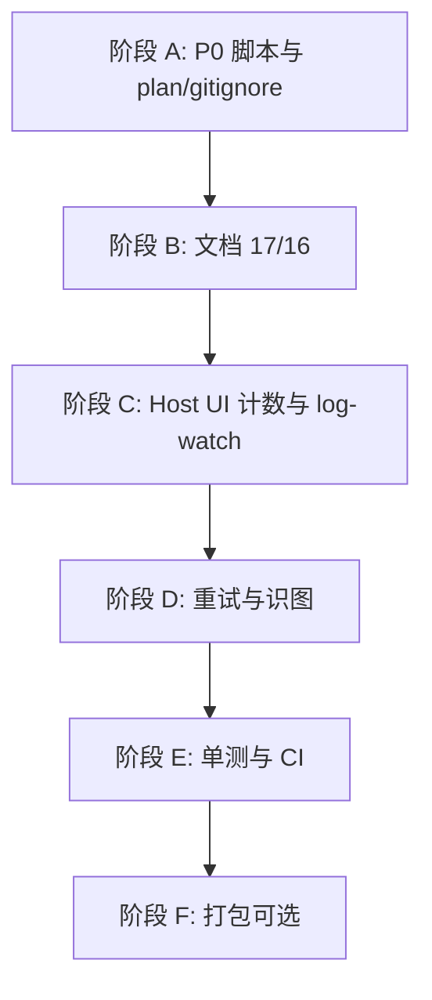

# 风险审计与修复计划（只读审计产物）

> **约束**：本文件为审计与修复跟踪。阶段 A–F 主体已完成（见 §8）。**R-P2-01**（extension 动态拆 smoke bundle）仍为可选大改。

## 8. 实施状态（2026-05-26）

| 阶段 | 状态 | 摘要 |
|------|------|------|
| A P0 脚本 / plan gitignore | ✅ | `release:vsix` → `scripts/release-vsix.mjs`；`install:vscode` → 0.2.0；`plan/` 已纳入版本库 |
| B 文档 16+1 | ✅ | `readme.sections.json` + `npm run readme:generate`；`scripts/README.md` |
| C Host UI | ✅ | 可执行 turn 计数；budget 候选封顶 4；p5 `native-vision`；log-watch/validator 对齐；consistency 用 scenario 行锚点 |
| D 识图重试 | ✅ | `retry.enabled` 关闭格式环与结构化 HTTP 重试 |
| E 单测/CI | ✅ | `catalog:verify`（离线）、`verify:ci`、`secretsStorage` / `visionStructuredRetryPolicy` / `providerErrorSurface` |
| F Release 剔 e2e | ✅ | Release VSIX 拒 `out/e2e/**`；`smokeModeGate` 抽离 smoke 门闩 |

**R-P0-01～03**：已修复。**R-P1-01～06、09**：已修复。**R-P1-07**：UI + checklist 澄清 `retryOnFailure` 仅 agentSession 批次。**R-P1-08**：已缓解。**R-P2-01**：部分（VSIX 无 `out/e2e` 树；`extension.ts` 仍静态 import smoke 实现）。**R-P2-02**：部分（`providerErrorSurface` + pipeline；无 `provider.ts` 类级单测）。**R-P2-05**：consistency 场景锚点修复。**R-P2-07**：`catalog:verify` + `verify:ci`。**R-P2-09**：`smokePrompt.ts` SSOT。**R-P2-11**：`visionLogReplay` cache-hit 后禁止 `request.start`。**R-P2-12**：`docs/vision-route-order.md` + `visionRoutePipeline.ts`。**R-P2-03/04/06/08**：保留为设计权衡或低优先级。

## 0. 审计方法与记忆汇总规则

### 0.1 检查维度（除用户所列外补充）

| 维度 | 说明 |
|------|------|
| 需求 SSOT 漂移 | `VISION_FLOW_MASTER.plan.md`、`docs/PLAN_COVERAGE.md`、`README`/`readme.*`、`package.json`、运行时常量 |
| 语义重复实现 | 同一口令/Profile/重试/标记在多处定义 |
| 路径冲突 | 计划 mermaid vs 实际调用顺序；`kind` vs `modelProfile` vs 日志 marker |
| 分支不全 | skip、mock、缺 API key、wrapped-only、pipeline 挂起 |
| 重试叠层 | HTTP × 格式环 × Host UI 候选 × Provider 内置 |
| 测试与文档谎言 | 文档写 17 项默认跑 16 项；脚本路径不存在 |
| 打包/泄露 | Release VSIX 含 e2e；日志是否落密钥 |
| 死代码/弃用 API | `@deprecated` 仍导出、无引用或仍被误用 |
| CI 缺口 | catalog/readme/verify 未进默认 `npm test` |

### 0.2 分文件记忆状态（关键模块，已复验）

| 模块/文件 | 审计状态 | 结论摘要 |
|-----------|----------|----------|
| `src/e2e/hostUi/chat/hostUiModelProfiles.ts` | ✅ 已审 | TS 为 Profile SSOT；与 JSON 有单测对齐 |
| `src/e2e/hostUi/chat/integration.ts` | ✅ 已审 | 17 canonical / 16 default；budget 候选封顶 2 ≠ 实际 fallback 链 |
| `src/e2e/hostUi/chat/acceptance.ts` | ✅ 已审 | benchmark 仅 `listAll` / groups，不在 DEFAULT |
| `src/e2e/hostUi/chat/integrationRetry.ts` | ✅ 已审 | 测试专用重试；终局 `turn.exhausted` 非 `lm.error` |
| `src/e2e/driver/hostUiSmoke.ts` | ✅ 已审 | stall 15s×3；`request.end` 用名义计数不扣 skip |
| `src/e2e/driver/hostUiSmokeLogWatch.ts` | ✅ 已审 | `lm.error` 与 `integration.scenario.end ok:false` 策略分裂 |
| `src/providerTransientErrors.ts` | ✅ 已审 | 主要服务 E2E；生产 HTTP 走 `errors.ts` |
| `src/config/settings.ts` | ✅ 已审 | 生产 DEFAULT_RETRY 3×1s（已恢复） |
| `src/visionStructuredPass.ts` | ✅ 已审 | 格式环不看 `retry.enabled`；可与 HTTP 重试相乘 |
| `src/agentSession/retryStrategy.ts` | ✅ 已审 | `retryOnFailure` 仅测试引用 |
| `src/extension.ts` | ✅ 已审 | 生产入口 import 全量 `e2e/hostUi` |
| `package.json` | ✅ 已审 | `release:vsix` 路径断裂；`install:vscode` 0.1.6 |
| `resources/host-ui-model-profiles.json` | ✅ 已审 | 有 `hostUiModelProfiles.test.ts` 守护 |
| `plan/` 目录 | ✅ 已审 | **整目录 `.gitignore`** vs `planCoverageAudit` 要求存在 |
| `src/provider.ts` / `secrets.ts` | ⚠️ 抽样 | **无直接单测**（高风险未覆盖） |
| `src/toolCooperation/*`（40+ 文件） | ⚠️ 抽样 | 多数有单测；`visionRestoreWebPageScreenshot` 等无引用测试 |
| `scripts/dev/*` | ⚠️ 列出 | 无 npm script，维护性风险 |
| `media/`、`resources/prompts/` | ⏭ 未逐文件 | 静态资源，低风险 |

---

## 1. 发现清单（按严重度）

### P0 — 命令失败 / CI 阻断 / 明确错误配置

| ID | 问题 | 证据 | 复验方式 |
|----|------|------|----------|
| R-P0-01 | `npm run release:vsix` 指向 **不存在** 的 `scripts/release/release-vsix.mjs`；实际文件为 `scripts/release-vsix.mjs` | `package.json` L869；`Glob scripts/release/**` 为空 | `node scripts/release/release-vsix.mjs` 应失败；改为正确路径后 dry-run |
| R-P0-02 | `install:vscode` 安装 `copilot-bro-0.1.6.vsix`，与当前版本 **0.2.0** 不符 | `package.json` L870 | 检查仓库根目录 VSIX 文件名与 version 字段 |
| R-P0-03 | `.gitignore` 忽略整个 `plan/`，但 `planCoverageAudit.test.ts` **要求** `plan/VISION_FLOW_MASTER.plan.md` 等存在 | `.gitignore` L15；`planCoverageAudit.test.ts` L9-12 | 干净 clone（仅 tracked 文件）后 `npm test -- src/test/planCoverageAudit.test.ts` |

### P1 — 需求/文档/测试语义不一致（功能仍可能“偶然通过”）

| ID | 问题 | 证据 | 复验方式 |
|----|------|------|----------|
| R-P1-01 | README 写 Chat acceptance **「17 项」**，默认 `HOST_UI_SMOKE_CHAT_ACCEPTANCE_DEFAULT_IDS` 仅 **16 项**（缺 `p7-chat-benchmark-web-restore`） | `README.md` L609/L1238；`acceptance.ts` CORE 12 + EXT 4 | 不设 env 跑 acceptance，数 `integration.scenario.start` 条数 |
| R-P1-02 | `p5-qwen-vl-native-chat`：`kind: "vision-proxy"` 但 markers 要求 `strategy":"native"`，acceptance 归入 `vision-native` | `integration.ts` L184-199；`acceptance.ts` L60 | 跑 p5，核对 `vision.route.selected` 与 skip 逻辑 `extensionSmokeChat.ts` L454-458 |
| R-P1-03 | `countIntegrationLmRequestBudget` 每 turn **最多算 2 个候选**，`integrationRetry` 遍历 **完整** Profile 链（如 zhipu 4 模型） | `integration.ts` L486-487 | 1305 压力下对比 `computeHostUiSmokeParticipantTimeoutMs` 与实际墙钟 |
| R-P1-04 | `waitForAnyRequestEndCount` 用 **名义** turn 数，**不扣除** skip 场景；部分 key 缺失时易 stall 或计数不足 | `integration.ts` L493-502；`hostUiSmoke.ts` L502 | 仅配 `DEEPSEEK_API_KEY` 跑默认 integration |
| R-P1-05 | 事后 `validateHostUiSmokeChatIntegrationEvidence` 接受 `scenario.end ok:false`；实时 `scanChatLogTail` 对同情况报 `integration-failed` | `hostUiSmokeAssertions.ts`；`hostUiSmokeLogWatch.ts` L230-240 | 构造 marker 缺失：participant 应失败，单独调 validator 可能返回 `[]` |
| R-P1-06 | `retry.enabled=false` **不关闭**识图格式重试环，仅关闭 HTTP `executeWithRetry` | `visionStructuredPass.ts` L131；`client.ts` L112-114 | 配置 panel 关 retry 后触发非法 JSON |
| R-P1-07 | `visionAgent.retryOnFailure` 在 UI/README 有描述，`shouldRetry` **仅测试引用** | `rg shouldRetry src` | 产品文档与 `sessionManager` 行为对照 |
| R-P1-08 | Native 结构化：HTTP 重试 × 格式重试，最坏约 **maxAttempts²** 级调用 | `visionStructuredPass.ts` L131-156 + L297-310 | 日志/代理统计同 requestId 请求次数 |
| R-P1-09 | `scripts/README.md` 声明 `release/` 子目录，与 `package.json` 不一致 | `scripts/README.md` L8 | 文档与脚本目录列表对照 |

### P2 — 健壮性 / 维护 / 打包

| ID | 问题 | 证据 |
|----|------|------|
| R-P2-01 | Release VSIX **仍含** `out/e2e/hostUi/**`（仅剔除 `out/e2e/driver`）；`extension.ts` 硬编码 import e2e | `extension.ts` L3-43；`tsconfig.extension.json` 含 e2e |
| R-P2-02 | `provider.ts`、`secrets.ts`、`providerVisionBranch.ts`、`configPanel.ts` **无直接单测** | `src/test` 无对应 `*.test.ts` |
| R-P2-03 | Proxy/wrapped 视觉路径 **无** 扩展层 HTTP 重试，与 native 不对称 | `visionStructuredPass.ts` proxy 分支 |
| R-P2-04 | `providerTransientErrors` 智谱码表；其他供应商主要靠 HTTP status | `providerTransientErrors.ts` |
| R-P2-05 | `consistency.ts` 用子串 `indexOf("vision-proxy-miss")` 可能误匹配 | 构造污染日志行测试 |
| R-P2-06 | Kimi **无** catalog 生成器，与 Qwen/Zhipu 不对称 | `scripts/catalog/` |
| R-P2-07 | Catalog 再生 **无 CI** 门禁 | 手动 `catalog:qwen` / `catalog:zhipu` |
| R-P2-08 | 未挂 npm 的 `scripts/dev/*`、`scrape-bailian` 等 | 目录列表 |
| R-P2-09 | `HOST_UI_SMOKE_PROMPT` 与 `HOST_UI_SMOKE_LM_PROMPT` 双常量 | `extensionSmokeRuntime.ts` / `hostUiSmoke.ts` |
| R-P2-10 | `inferProfileId` 无法区分 `zhipu.text` vs `zhipu.text.tool` | `hostUiModelProfiles.ts` L126-127 |
| R-P2-11 | 计划 P7「重放无二次 request.start」— `visionLogReplay` **未实现** | `VISION_FLOW_MASTER` §7；`visionLogReplay.ts` |
| R-P2-12 | Native 预结构化路由与计划 mermaid **顺序不一致** | `providerVisionBranch.ts` vs plan flowchart |

### P3 — 低优先级 / 信息

| ID | 问题 |
|----|------|
| R-P3-01 | `@deprecated` 导出仍保留（`modelCandidates` ZHIPU_*、`configPanelPersistence` 等） |
| R-P3-02 | 三套退避算法（HTTP / E2E / agentSession）未统一 |
| R-P3-03 | Native 结构化 HTTP 重试无 `request.retry` 日志 |
| R-P3-04 | `CHAT_INTEGRATION_SCENARIO_EXTRA_MARKERS` 与 `integration.requiredLogMarkers` 部分重复 |

---

## 2. 修复计划（分阶段步骤）

> 每阶段：**实施 → 一致性复验 → 测试（已有 + 新增）→ 记录结果**。未通过不得进入下一阶段。

### 阶段 A：P0 配置与仓库卫生（不改业务逻辑）

**A.1 修复 npm 脚本路径**

- 将 `release:vsix` 改为 `node scripts/release-vsix.mjs`（或移动文件到 `scripts/release/` 并更新文档）。
- 将 `install:vscode` 改为 `copilot-bro-<version>.vsix` 或 `npm run package:release` 产物。

**A.1 多轮校验**

1. `node <script>` 存在性检查（不发布也可 `--help` 或 dry-run）。
2. `npm run package:verify-release:build`（若环境允许）。
3. `rg "scripts/release/" package.json scripts/README.md` 零错误引用。

**A.1 测试**

- `npm test`（无回归）。
- 可选：手工 `npm run release:vsix`（需 `gh` 与 tag）。

---

**A.2 解决 `plan/` 与 gitignore 冲突**

- 方案二选一（须团队决策）：(a) 从 `.gitignore` 移除 `plan/`，提交计划文件；或 (b) 将 `planCoverageAudit` 改为只依赖 `docs/PLAN_COVERAGE.md`，计划移入 `docs/`。

**A.2 多轮校验**

1. 模拟 clean tree：`git check-ignore -v plan/VISION_FLOW_MASTER.plan.md`。
2. `npm test -- src/test/planCoverageAudit.test.ts`。

---

### 阶段 B：文档与验收语义对齐（低风险）

**B.1 README / CHANGELOG / readme.config「17 vs 16」**

- 明确：默认 acceptance = **16**；第 17 项 `p7-chat-benchmark-web-restore` 需显式 env 或 `listAllChatAcceptanceScenarioIds`。
- 或把 benchmark 纳入 `DEFAULT_IDS`（需评估 600s 成本）。

**B.1 校验**

1. `npm run readme:check`。
2. `npm test -- src/test/readmeDocs.test.ts`。
3. `npm test -- src/test/hostUiSmokeChatAcceptance.test.ts`（更新断言若改 DEFAULT）。

**B.2 scripts/README.md 与 package.json 脚本表一致**

- 校验：`rg "scripts/release" .` 仅出现在历史/备份。

---

### 阶段 C：Host UI 计数、超时、log-watch 一致性

**C.1 统一 LM 计数模型**

- 选项：stall 门闩改用 `countIntegrationLmRequestBudget` 或「名义 − 已 skip」；budget 取消 `min(candidates,2)` 封顶或改为 `min(candidates, maxFallbackSlots)` 可配置。

**C.1 校验（至少 3 轮）**

1. 单元：`hostUiSmokeChatIntegration.test.ts`、`hostUiSmokeP4RouteChat.test.ts` 更新预期。
2. 部分 key：`COPILOT_BRO_UI_SMOKE_CHAT_INTEGRATION_SCENARIOS=vision-proxy-miss,vision-proxy-cache-hit` + 仅 deepseek key。
3. 全量：`npm run test:host-ui:chat-acceptance`（Windows + VS Code + 真实 key）。
4. 读 `artifacts/host-ui/host-ui-smoke.log`：无 stall、无假阳性 `lm-error`。

**C.2 log-watch 与 assertions 策略统一**

- 约定：`ok:false` 非 skip 一律失败；或 validator 与 watch 共用 `scanChatLogTail` 规则。

**C.2 校验**

1. `npm test -- src/test/hostUiSmokeLogWatch.test.ts`。
2. 新增/更新：marker 失败用例 **同时** 测 watch + validator。
3. Host UI 故意缺 marker 场景（仅本地）：应一致失败。

**C.3 p5 `kind` 与分组**

- 将 `p5` 的 `kind` 改为 `native-vision` 或新增 `kind` 枚举；同步 `scenarioRequiresVisionApi` / skip 逻辑。

**C.3 校验**

1. `assertIntegrationScenarioCoversPlanPhases` 全通过。
2. 单场景 env：`p5-qwen-vl-native-chat`。
3. 全量 acceptance。

---

### 阶段 D：重试与识图策略（生产行为，须谨慎）

**D.1 识图格式环尊重 `retry.enabled`**

- `resolveStructuredVisionDescription` 在 `!settings.retry.enabled` 时 `maxAttempts=1`。

**D.1 校验**

1. `npm test -- src/test/visionProxy.test.ts`（及相关）。
2. 手工：关 retry + 坏 JSON，确认单次 `vision.proxy.format.invalid`。
3. Host UI vision 场景抽样。

**D.2 限制 HTTP×格式叠层**

- 识图 pass 使用 `maxAttempts: 1` 或独立 `visionRetry` 配置，与全局 `retry` 分离。

**D.2 校验**

1. 单测 mock 计数 fetch 次数。
2. 对比改动前后 P95 延迟与账单（若有）。

**D.3 接通或删除 `visionAgent.retryOnFailure`**

- 若接通：`sessionManager`/`batchPlanner` 调用 `shouldRetry`；若删除：UI 字段标记 deprecated 并改 README。

**D.3 校验**

1. `npm test -- src/test/agentSession.test.ts`。
2. `npm test -- src/test/phase1ConfigUi.test.ts`。

**D.4 Proxy HTTP 重试对称性（可选）**

- 评估 `proxyModel.sendRequest` 外包 `executeWithRetry` 的可行性（注意 VS Code LM API 语义）。

---

### 阶段 E：测试缺口与 CI 门禁

**E.1 为核心无测模块补最小单测**

- 优先：`provider.ts`（错误路径）、`secrets.ts`（不落日志）、`providerVisionBranch.ts`（路由分支表）。

**E.1 校验**

1. `npm test` 计数增加。
2. 突变测试：故意改路由常量，单测应红。

**E.2 CI 可选 job**

- `npm run catalog:qwen && git diff --exit-code`（zhipu 同理）。
- `npm run readme:check`。
- `npm run package:verify`（发布前）。

**E.3 benchmark 场景策略**

- 文档化：默认不跑；nightly 用 `listAllChatAcceptanceScenarioIds` + `COPILOT_BRO_UI_SMOKE_CHAT_INTEGRATION_SCENARIOS`。

---

### 阶段 F：打包与攻击面

**F.1 Release 不含 e2e 实现（可选大改）**

- 将 smoke 移出 `extension.ts` 生产路径，或 `tsconfig.release.json` 排除 `src/e2e/**` + 条件编译。

**F.1 校验**

1. `npm run package:release` + `npm test -- src/test/packageContentsCheck.test.ts`。
2. 解压 VSIX：无 `out/e2e/hostUi`（若为目标）。

---

## 3. 测试矩阵（已有 + 建议新增）

| 类别 | 已有命令/测试 | 本计划建议补充 |
|------|----------------|----------------|
| 单元全量 | `npm test` | 每阶段 A–E 后必跑 |
| 编译 | `npm run compile` | 改 TS 后必跑 |
| Profile JSON | `hostUiModelProfiles.test.ts` | catalog 漂移 test |
| Host UI 逻辑 | `hostUiSmoke*/*.test.ts` | watch/validator 一致用例 |
| Host UI 实机 | `npm run test:host-ui:chat-acceptance` | C/D 阶段后全量 |
| 打包 | `package:verify*` | F 阶段 |
| README | `readme:check` | B 阶段 |
| 计划存在 | `planCoverageAudit.test.ts` | A.2 后 clean clone |

---

## 4. 需求不丢失检查表

| 需求来源 | 必须在修复后仍成立 |
|----------|-------------------|
| VISION_FLOW p3–p7 日志 marker | `planCoverage` + Host UI evidence |
| 默认 DeepSeek v4 Flash + 免费 GLM 视觉 | `hostUiModelProfiles` / env override |
| 测试重试仅 Host UI | 生产 `DEFAULT_RETRY` 保持保守 |
| provider-token 三家覆盖 | `provider-token-smoke-chat` 三 turn |
| 图像后处理暂停 | `HIGH_FIDELITY_RESTORE_IMAGE_PIPELINE_SUSPENDED` |
| VSIX test vs release 策略 | `packagingIgnore.test.ts` |

---

## 5. 诚实声明与未覆盖范围

1. **未对 308 个文件逐行人工审阅**；采用分域代理 + 主路径复验；`toolCooperation` 下未测文件仅列目录级风险。
2. **Host UI 实机**结果随 API 限流波动；审计日曾出现 1305/stall，修复后须再跑 acceptance 确认。
3. 本计划 **不保证** 按阶段执行后零风险；P1/P2 中部分项为设计权衡（如 benchmark 不进 default），需产品确认而非纯 bugfix。
4. 执行修复时 **不得** 以“单测绿”替代 Host UI 实机（对 e2e 行为变更）。

---

## 6. 建议执行顺序（优先级）

---

## 7. 记忆索引（后续会话接续）

- Host UI Profile SSOT：`src/e2e/hostUi/chat/hostUiModelProfiles.ts`
- 默认 16 场景：`acceptance.ts` `HOST_UI_SMOKE_CHAT_ACCEPTANCE_DEFAULT_IDS`
- 第 17 项 benchmark：`p7-chat-benchmark-web-restore`（600s turn）
- 重试：生产 `settings.ts`；测试 `modelCandidates.ts` + `integrationRetry.ts`
- 审计日期：2026-05-25；单元测试 524 pass；acceptance 在计数修复后曾 pass，1305 为环境性风险

---

*本文件由只读审计生成。实施变更请另开 PR 并引用本计划 ID（R-P0-xx …）。*
