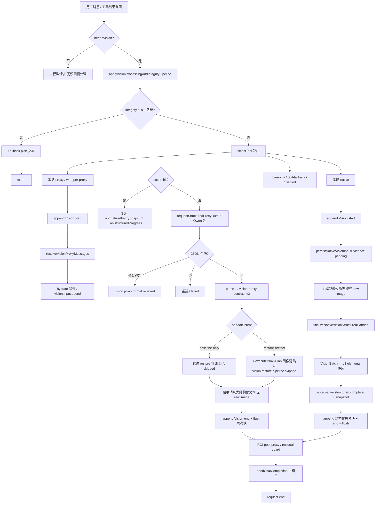

# Copilot Bro 识图与模型体系 — 主计划（权威）

> **本文件为 `plan/` 目录下唯一执行与验收入口。**  
> 历史副本：`vision-flow-fix_reordered_final.plan.md`（过程记录）、`PLAN_COVERAGE.md`（已并入下表）、`vision-flow-plan-section-7.2.md`（已并入 §7.2）、`VISION_EXECUTION_ANALYSIS.md`（深度分析附录，不删）。

## 状态图例

| 标记 | 含义 |
|------|------|
| ✅ **已完成** | 已实现且有单测/Host UI 证据 |
| 🔄 **进行中** | 部分落地或需持续维护 |
| ⏸ **暂停开发** | 代码保留，运行时由开关跳过；验收用 `"skipped":true` |
| 📋 **待办** | 依赖恢复图像后处理或后续迭代 |

## 全局开关（图像后处理）

- **常量**：`src/config/highFidelityRestoreImagePipelineSuspended.ts` → `HIGH_FIDELITY_RESTORE_IMAGE_PIPELINE_SUSPENDED = true`
- **⏸ 暂停**：`restore-artifact` 下矢量化/抠图/`produceRestoreElementOutputs`/整页 SSIM/Chromium 重放
- **✅ 仍运行**：识图代理结构化 JSON、高保真文本契约、`vision.input.bound`、证据/任务栈、native/proxy 同级 **vision-proxy-contract-v3** 快照、Chat `[Vision]` 批处理思考块

---

## 识图执行流程（剔除图像后处理之后）

以下流程为 **当前生产路径**（`HIGH_FIDELITY_RESTORE_IMAGE_PIPELINE_SUSPENDED=true`）。⏸ 标步骤在恢复 pipeline 后重新启用。



**要点**：

1. **Proxy**：图像不进入主模型；主模型只读 `normalizedProxySnapshot` + 高保真描述文本。  
2. **Native**：图像仍转发给视觉模型；流结束后解析 `VisionBatchResult` 并 **升级为与 proxy 相同的 v3 `elements[]` 快照**（`visionBatchToProxyStructured.ts`）。  
3. **思考块**：`visionProgressReporter` 合并多段 `[Vision]`，单次 `LanguageModelThinkingPart`（id=`vision-status`）或 `<details data-extended-models-vision>`。  
4. **⏸ 图像后处理**：不在上图主路径中执行；日志必须含 `vision.restore.pipeline.skipped` / `image-pipeline-suspended` 或 Host UI `"skipped":true`。

---

## 阶段覆盖表（p0–p11）

| 阶段 | 状态 | 关键实现 | 测试 / 证据 |
|------|------|----------|-------------|
| **p0** 需求与证据 | ✅ | `visionLogReplay.ts`、本计划 | `visionLogReplay.test.ts`、`hostUiSmokeAssertions` |
| **p1** 快修与门禁 | ✅ | `configPanelShared.ts`、`settings.ts` | `npm test`、`configPanel*.test.ts` |
| **p2** 真实 E2E | ✅ | `automation/hostUiSmoke.ts` | `npm run test:host-ui` |
| **p3** 日志与 cache | ✅ | `visionProxy.ts`、`visionProgressReporter.ts` | `vision-proxy-miss/hit`、`vision.input.bound` |
| **p4** 路由契约 | ✅ | `compatibilityMatrix.ts`、`hostUiSmokeP4RouteChat.ts` | `p4-self-refer-proxy-chat`、`screenshot-page-vision-route` |
| **p5** 模型 / Qwen / UI | ✅ | `qwenCatalogContract.ts`、`configPanel.ts` | `p5-qwen-vl-native-chat`、`provider-probe` |
| **p6** 证据与任务栈 | ✅ | `visionEvidenceStore.ts`、`nativeVisionStructuredHandoff.ts`、`visionBatchToProxyStructured.ts` | `nativeVisionStructuredHandoff.test.ts`、`p6-path-hydration-chat` |
| **p7** 产物保真 | ✅ 结构化 / ⏸ 图像链 | 开关见上；`visionProxyStructuredPlan.ts` | 暂停期：`pipeline.skipped`、`page-ssim` `"skipped":true` |
| **p8** 记忆与 token | ⏸ **暂不实现** | 占位：`longTermMemory.ts`（仅 budgeter 探针） | `agent-smoke-budgeted` 验 greedy-prefix；完整记忆 **不做验收** |
| **p9** README | ✅ | `scripts/generate-readme.mjs` | `npm run readme:check` |
| **p10** 打包 | ✅ | `package-vsix.mjs`、`check-vsix-contents.mjs` | `vsixPackagePolicy.test.ts` |
| **p11** 最终审计 | ✅ | `planCoverageAudit.test.ts`、验收矩阵 | 全量 `npm test`；Host UI Chat 见下表 |

### 阶段 9–11 收尾（当前）

| 阶段 | 状态 | 交付 |
|------|------|------|
| **p9** README | ✅ | `npm run readme:check` |
| **p10** 打包 | ✅ | `npm run package:test` + `package:check` |
| **p11** 审计 | ✅ | `planCoverageAudit` + Host UI 验收矩阵（配置 roundtrip + Chat acceptance） |

### Host UI 验收矩阵（配置 + Chat）

**配置（Phase1 + 工作区）**

| 检查 | 命令 / 证据 |
|------|-------------|
| 每项 Phase1 可见字段存在 | `host-ui-smoke.phase1.settings.field`（exhaustive） |
| 每项可写回读 | `host-ui-smoke.phase1.settings.roundtrip` + `.end` `"ok":true` |
| 配置面板模型/温度 | `config-panel` smoke（`hostUiSmoke.ts`） |

**Chat 集成（默认 `COPILOT_BRO_UI_SMOKE_CHAT_INTEGRATION_SCENARIOS` 未设 = 全量 acceptance 列表）**

| 分组 | 场景 id |
|------|---------|
| 代理识图 | `p3-global-qwen-proxy-chat`、`vision-proxy-miss`、`vision-proxy-cache-hit` |
| native 识图 | `p5-qwen-vl-native-chat`、`native-vision-zhipu-chat` |
| 供应商 token | `provider-zhipu-token-chat`、`provider-minimax-token-chat`、`provider-kimi-token-chat`、`tool-call-model-chat` |
| 切换/多轮 | `model-switch-pro-token`、`multi-turn-vision-then-token`、`multi-provider-switch-context` |
| 路由 p4 | `p4-self-refer-proxy-chat`、`p4-wrapped-vision-chat` |
| p6/p7 | `p6-path-hydration-chat`、`p7-describe-only-evidence`、`p7-restore-artifact-chat`（暂停期验 skipped） |

**多轮一致性**：套件结束日志 `host-ui-smoke.chat.consistency.end` `"ok":true`（`hostUiSmokeChatConsistency.ts`）。

**Ask / Agent**：默认 **Ask**（`host-ui-smoke.chat.mode` `"mode":"ask"`）；Agent 模式：`COPILOT_BRO_UI_SMOKE_CHAT_MODE=agent` + `npm run test:host-ui:chat-agent`。

---

## 阶段 7 分项

| 子项 | 状态 | 说明 |
|------|------|------|
| Artifact store | ✅ | `visionArtifactStore.ts` |
| 禁用 bbox 占位 SVG | ✅ | `allowBBoxPlaceholderSvg: false` |
| 删除 bbox seed | ✅ | 生产 SVG 来自矢量化链（⏸ 运行时未调用） |
| raster→vector / 抠图 / 形变 | ⏸ | 代码在 `rasterVectorizer.ts`、`restorationPipeline.ts` |
| LLM plan + 工具执行 | ✅ 规划 / ⏸ 图像执行 | `visionProxyStructuredPlan.ts` |
| 任务栈 | ✅ | `visionTaskStack.ts` |
| 保真报告 SSIM | ⏸ | `visionRestoreFidelityReport.ts` |
| plan.replay（不重复识图） | ✅ | `vision.proxy.plan.replay` |
| bbox clamp | ✅ | `visionProxyBBox.ts` |
| JSON 修复层 | ✅ | `visionJsonExtract.ts` + `vision.proxy.format.repaired` |
| 保真软降级 `restoreDegradeOnFidelityFail` | 📋 | **仅恢复图像 pipeline 后需要**；暂停期不实施 |
| 日志回放 fixture 20260520-0943 | 📋 | 断言重试无同 hash 二次 `request.start` |

### 阶段 7.2（整页 Web SSIM ≥ 0.99）

| 项 | 状态 |
|----|------|
| 结构化 plan + 高保真文本 | ✅ |
| `executeProxyPlan` 图像链 + Chromium 重放 | ⏸ |
| `host-ui-smoke.chat.benchmark.page-ssim` `"passed":true` | ⏸（暂停期 `"skipped":true`） |
| 恢复后命令 | `npm run test:host-ui:chat-benchmark-web-restore`、`npm run test:benchmark-restore` |

**禁止回归**：fixture plan JSON 网格拼图抬 SSIM、`buildAdaptiveGridFallbackPlan` 等（见原 §7.2 废弃列表）。

---

## Host UI E2E

### 套件（`COPILOT_BRO_UI_SMOKE_E2E`）

- **`all`（默认）** = 全部套件：`github-chat-login`、`config-panel`、`chat-scenarios`、`provider-probe`、`preset-catalog`、`vision-contract`、`post-chat-lm`、`vision-probe`、`screenshot-page-vision-route`、`vision-chat-progress`、`phase1-settings-exhaustive`、`agent-smoke-budgeted`、`p6-p7-real-assets`（见 `hostUiSmokeE2eSuites.ts`）。
- **暂停步骤**：P7 离线探针 / Chat 集成在图像链处打 `"skipped":true` + `skipReason` / `image-pipeline-suspended`，**套件仍执行**，不得假通过。

### 常用命令

```bash
npm test
npm run test:host-ui              # 默认 E2E=all（全套件）
npm run test:host-ui:full         # 同 all
npm run test:host-ui:vision-chat-progress
npm run test:host-ui:p6-p7
npm run test:host-ui:chat-benchmark-web-restore  # 暂停期验 skipped
```

---

## native 与 proxy 结构化同级（✅ 已完成）

| 能力 | proxy | native |
|------|-------|--------|
| `vision.input.bound` | ✅ | ✅ |
| evidence + task stack | ✅ | ✅ |
| 契约版本 | `vision-proxy-contract-v3` | **同**（`convertVisionBatchToProxyStructuredOutput`） |
| Chat 结构化思考块 | `formatVisionStructuredThinkingBlock` | **同**（route=native） |
| 日志 | `vision.proxy.structured` / cache | `vision.native.structured.completed` + `vision.native.structured.snapshot` |

---

## 配置：`spatialSchemaVersion`（空间协议版本）

| 项 | 结论 |
|----|------|
| 默认值 | **`v1`**（`contractConfig.ts`、`package.json` defaults） |
| 作用 | 注入 `vision-prompt-contract-v1` 系统提示（`buildVisionPromptContract`），要求几何字段与 `GeometryProtocol.version` 对齐 |
| 是否删除 | **否** — 排障与协议迁移需要 |
| 是否更新 | **一般保持 v1**；仅当升级 GeometryProtocol 时改为 `v2` 并同步 README/测试 |
| 注意 | 单测中偶见 `"1"` 与 `"v1"` 混用仅用于契约文本，**运行默认以 `v1` 为准** |

---

## 执行原则（保留）

- 所有需求为必须项；禁止「仅测试可达」假功能。
- 真实 API 环境变量：`DEEPSEEK_API_KEY`、`ZHIPU_API_KEY`、`DASHSCOPE_API_KEY`、`MINIMAX_API_KEY`、`KIMI_API_KEY`；缺失时 **skip**，不得误报通过。
- 任务树顺序：bug/test → logs/cache → route → models → evidence → artifacts（⏸ 图像）→ memory → docs → packaging → audit。

---

## 附录

- **深度执行分析**：`plan/VISION_EXECUTION_ANALYSIS.md`（826 行，保留不合并正文，仅交叉引用）。
- **历史过程记录**：`plan/vision-flow-fix_reordered_final.plan.md`（增补段落与日期记录）。
