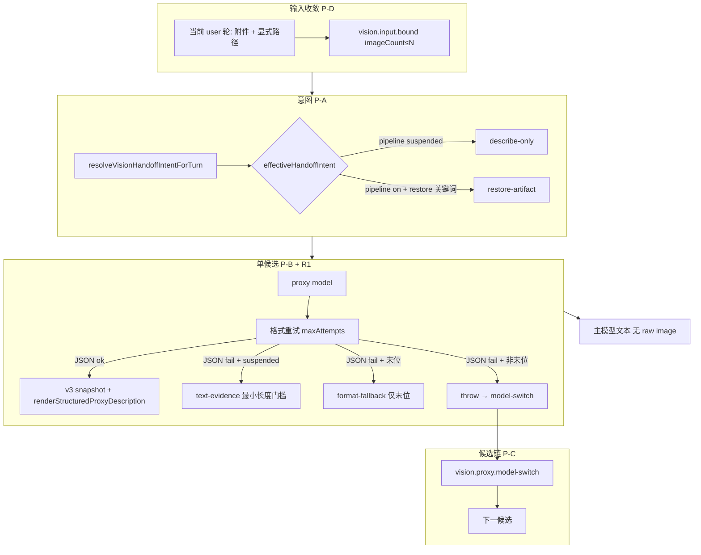

# 识图代理鲁棒性 — 细化实施计划

> **读者**：实现者与验收者。  
> **非目标**：恢复 `HIGH_FIDELITY_RESTORE_IMAGE_PIPELINE_SUSPENDED=false` 后的 SSIM/矢量化；Chat `[Vision]` 折叠（见 `VISION_UI_AND_PROXY_RETRY.plan.md`）；长期记忆 p8。

---

## 0. 需求冻结（不可破坏）

| ID | 契约 | 验收方式 |
|----|------|----------|
| R1 | **同代理模型**在切换候选前，必须先耗尽 **格式重试**（`resolveStructuredVisionFormatMaxAttempts`）与 **429 重试**（`runVisionProxyDescriptionWithRetry` / `customListMaxRetriesPerModel`） | 日志：`vision.proxy.format.invalid` 同一 `proxyModelId` 连续 attempt；`vision.proxy.retry` 同 modelLabel；**之后**才出现 `vision.proxy.model-switch` |
| R2 | **仅最后一个** custom-list 候选允许 `format-fallback`（`buildMinimalStructuredVisionFallback`） | 非末位候选不得出现 `vision.proxy.structured.format-fallback` |
| R3 | 暂停期 **无** PNG/SVG 落盘、`processedImageParts` 非空不得触发 persist | `vision.restore.pipeline.skipped` / 无 `vision-artifacts/` 新文件；`highFidelityRestoreImagePipeline.test.ts` |
| R4 | 主模型仍收到 **可读的识图文本**（结构化渲染或高保真文本证据），不得因无 JSON 整链失败导致 Copilot「Sorry, no response was returned」 | proxy 成功后 `request.messages.summary` `hasImageParts:false`；Chat 有 assistant 正文 |
| R5 | `format-fallback` 与 **文本证据** 结果 **不得写入** `visionProxyDescriptionCache` | cache miss 后下一候选仍被调用；单测 mock cache |
| R6 | 嵌套识图：`isVisionOrchestrationSuppressed()` 时 **不** 跑 native 结构化旁路 | 已有 `visionOrchestrationContext.test.ts` + proxy 场景无 `vision.native.structured` 抢跑 |

---

## 1. 问题与根因（实现前共识）

| 现象 | 根因 | 本计划对应项 |
|------|------|----------------|
| custom-list 不切模型 | `applyStructuredVisionToMessageBatch` 在 `reportFailure` 时 **return `{ status:"failed" }` 不 throw** → `runVisionProxyCandidateChain` 认为 invoke **成功** | **P-C** |
| GLM 有长文本无 JSON 仍失败 | `parseStructuredProxyOutput` 失败后仅 format-retry，末位才 generic fallback；无「暂停期接受原文」 | **P-B** |
| `imageCount=6` | `hydrateImagePartsFromTextPaths` 扫描 **整段会话** 文本路径 + 多消息附图 | **P-D** |
| `handoffIntent=restore-artifact` 但 pipeline 已停 | 用户/全局 prompt 含 restore 关键词 → 模型被要求出 svg plan，执行却被 skip | **P-A** |
| 误缓存劣质描述 | format-fallback 已加 `formatFallbackUsed` 守卫 | **P-E**（回归） |

---

## 2. 目标架构（暂停期生产路径）



**证据双形态（暂停期）**：

| 形态 | 条件 | 主模型输入 | 日志 |
|------|------|------------|------|
| 结构化 v3 | `parseStructuredProxyOutput` 成功 | `renderStructuredProxyDescription` + `normalizedProxySnapshot` | `vision.proxy.structured` |
| 文本证据 | pipeline 暂停 + 末位或「非 JSON 但正文≥阈值」策略见 §4.2 | 消毒后的 model raw text（截断 + 无 code fence 注入） | `vision.proxy.text-evidence.accepted` |
| format-fallback | 仅末位 + `shouldUseStructuredVisionFormatFallback` | 最小 v3 fallback 渲染 | `vision.proxy.structured.format-fallback` |

---

## 3. 实施阶段（严格顺序）

### P-A — 有效 handoff 单入口（意图降级）

**目的**：暂停期不向模型索要不可执行的 restore plan。

| 项 | 内容 |
|----|------|
| 新增 | `resolveEffectiveVisionHandoffIntent(userTurn, proxyPrompt): VisionHandoffIntent` 于 `visionHandoffIntent.ts`（或 `highFidelityRestoreImagePipelineSuspended.ts` 旁 **二选一**，只保留一处调用） |
| 规则 | 若 `HIGH_FIDELITY_RESTORE_IMAGE_PIPELINE_SUSPENDED` → **恒为** `describe-only`；否则保持现有 `resolveVisionHandoffIntentForTurn` |
| 改调用点 | **仅** `structuredVisionMessageBatch.ts` 中计算 `handoffIntent` 处（约 L140）；`executeProxyPlan` / prompt 构建继续吃 effective 值 |
| 不改 | `resolveVisionHandoffIntent` 正则表、Host UI p7-restore 场景 prompt（仍测 skipped） |

**单测** `visionHandoffIntent.test.ts`：

- suspended + 用户含 `restore-artifact` → `describe-only`
- suspended=false + restore 关键词 → `restore-artifact`

---

### P-B — 暂停期文本证据（GLM 等非 JSON）

**目的**：后处理关闭时，**JSON 不是成功必要条件**；仍要 R4 可读描述。

| 项 | 内容 |
|----|------|
| 新增 | `acceptStructuredVisionTextEvidence(raw, opts): { accepted, description, reason }` 于 `visionProxyStructuredPlan.ts`（无 vscode 依赖） |
| 门槛建议 | `raw.trim().length >= 80`；拒绝纯 JSON 失败占位、拒绝与 `errorMessages.visionProxyFailed` 相同文案；可选：拒绝 dominantly `{` 且 parse 失败（防半拉 JSON） |
| 接入 | `resolveStructuredVisionDescription`（`visionStructuredPass.ts`）在 **for 循环耗尽** 后、`shouldUseStructuredVisionFormatFallback` **之前**：若 `!isStructuredVisionImageOutputEnabled(handoffIntent)` 且 `accept...` → 返回 `{ description, execution: buildStructuredOnlyProxyExecutionSummary(...), formatFallbackUsed: false, textEvidenceUsed: true }` |
| 非末位 | **禁止** text-evidence 成功（与 format-fallback 对称）→ **throw**，触发 P-C 切模型 |
| 末位 | 允许 text-evidence；仍禁止 cache（`textEvidenceUsed` 同 `formatFallbackUsed` 守卫） |
| 日志 | `vision.proxy.text-evidence.accepted` `{ proxyModelId, rawLength, lastFailure }` |

**单测** 新文件 `visionProxyTextEvidence.test.ts`：

- 短文本 / 空 → 不 accept
- 长中文描述 → accept
- 非末位策略：由 `resolveStructuredVisionDescription` 集成测 mock（见 P-C 测试）

**禁止**：暂停期用 text-evidence 触发 `executeProxyPlan` 图像任务。

---

### P-C — 候选链与 batch 失败语义对齐

**目的**：非末位 format 失败 / 非末位无 text-evidence 必须 **throw**，`runVisionProxyCandidateChain` 才能 `vision.proxy.model-switch`。

| 方案（二选一，推荐 A） | 做法 |
|------------------------|------|
| **A** | `applyStructuredVisionToMessageBatch`：`reportFailure` 且 catch 到 error → **rethrow**（或 `throw` 包装 `visionProxyFailed`），不再 return `status:"failed"` 给链 |
| **B** | `visionProxy.ts` 在 `runVisionProxyCandidateChain` 的 invoke 内：`if (batch.status === "failed") throw new Error(batch.error)` |

**附带**：`resolveStructuredProxyDescription` 已 throw；确认 **无** 路径在 catch 内吞掉后 return applied。

**单测** `visionProxyCandidateChainFailure.test.ts`（可并入 `visionProxyRetryCoordinator.test.ts`）：

- Mock `resolveDescription` 前 2 次 throw，第 3 次成功 → 恰好 2 条 `model-switch`
- Mock 始终 throw → 最终 reject，且 switch 次数 = `candidates.length - 1`

---

### P-D — 识图输入收敛（imageCount）

**目的**：单轮用户只识 **当前轮** 明确图片，避免历史路径/工具结果批量 hydration。

| 项 | 内容 |
|----|------|
| 策略 | 在 `hydrateImagePartsFromTextPaths` 或 **上游** `resolveVisionProxyMessages`：仅对 **最后一条 user 消息** 做路径 hydration（附件已在 message 上的不受影响） |
| 或 | `createImagePathHydrationPolicy` 增加 `scope: "last-user-only"`，默认在 proxy 路径启用 |
| 日志 | `vision.proxy.hydrated.imagePaths` 增加 `scopedMessageIndex`；`vision.input.bound` 的 `imageCount` 在单图场景恒为 1 |
| 不改 | p6-path-hydration **探针** 若需全量扫描，用 `hydrateImagePartsFromTextPathsForSmoke` 显式传旧 policy |

**单测** `visionPathHydrationScope.test.ts`：

- 3 条 user 历史各含不同 png 路径，仅最后一条 user 带附件意图 → hydratedCount=1
- 同路径去重仍有效（`seenPaths`）

**Host UI**：不强制新场景；在 `p6-path-hydration-chat` 或 `multi-turn-vision-then-token` 的 consistency 断言中加 `imageCount` 上限（见 §6）。

---

### P-E — 缓存与 orchestration（回归加固）

| 项 | 状态 |
|----|------|
| `formatFallbackUsed` 不 cache | ✅ 已有，加回归测 |
| `textEvidenceUsed` 不 cache | P-B 新增字段，同守卫 |
| `isVisionOrchestrationSuppressed` native 跳过 | ✅ 已有 |
| 非末位 `allowInvalidFormatFallback: false` | ✅ `visionProxy.ts` L177-178 |

---

## 4. 重试与切换 — 行为矩阵（实现对照表）

设 `customList = [A, B, C]`，`formatMax=3`，`rateMax=3`。

| 事件 | 模型 A 行为 | 是否切到 B |
|------|-------------|------------|
| 429 第 1-2 次 | `vision.proxy.retry` delay | 否 |
| 429 第 3 次仍失败 | throw rate-limit | **是** `rate-limit-exhausted` |
| invalid JSON 第 1-2 次 | `vision.proxy.format.invalid` | 否 |
| invalid JSON 第 3 次，A 非末位 | throw | **是** |
| invalid JSON 第 3 次，C 末位，暂停期长文本 | `vision.proxy.text-evidence.accepted` | 否（成功结束链） |
| invalid JSON 第 3 次，C 末位，短文本 | `vision.proxy.structured.format-fallback` 或最终 failed | 否 |
| `applyStructuredVision` return failed 不 throw | （当前 bug）链停 A | **P-C 修复后不再发生** |

---

## 5. 文件.touch 清单（防扩散）

| 文件 | P-A | P-B | P-C | P-D | 备注 |
|------|-----|-----|-----|-----|------|
| `visionHandoffIntent.ts` / `highFidelity...ts` | ✓ | | | | 二选一 |
| `visionProxyStructuredPlan.ts` | | ✓ | | | text evidence 纯函数 |
| `visionStructuredPass.ts` | | ✓ | | | 接入 text evidence |
| `structuredVisionMessageBatch.ts` | ✓ | | ✓? | | handoff + 可选 rethrow |
| `visionProxy.ts` | | | ✓ | ✓ | chain + hydration 范围 |
| `visionPathHydrationPolicy.ts` | | | | ✓ | scope 类型 |
| `providerVisionBranch.ts` | | | | | **不改**（除非 failed 语义变化需处理） |
| `visionProgressReporter.ts` / UI | | | | | **不改** |
| `package.json` settings | | | | | **不改**（无新配置项） |

**明确不碰**：`rasterVectorizer.ts`、`restorationPipeline.ts`、`visionArtifactStore` 写入逻辑（除已有 gate 回归）、`VISION_UI_AND_PROXY_RETRY.plan.md` 范围。

---

## 6. 多轮一致性校验（具体断言）

在 `hostUiSmokeChatConsistency.ts` **仅当场景 ran** 时追加（不降低未跑场景通过率）。

| check id | 触发场景 | 断言 |
|----------|----------|------|
| `proxy-chain:model-switch-order` | 新增 opt-in `vision-proxy-custom-list-chain` 或扩展 `p3-global-qwen-proxy-chat` 配 `COPILOT_BRO_VISION_PROXY_CUSTOM_LIST` | 日志中 `vision.proxy.model-switch` 的 `from`/`to` 顺序与配置一致；首候选至少 1 次 `format.invalid` 或 `retry` 后才 switch |
| `proxy-input:imageCount-max` | `p6-path-hydration-chat`、`multi-turn-vision-then-token` | 每条 `vision.input.bound` 解析 `imageCount`，单图场景 **≤1**；多图场景 ≤ 声明附件数 |
| `proxy-cache:miss-before-hit` | 已有 `vision-proxy-miss` + `vision-proxy-cache-hit` | 保持 |
| `multi-turn:vision-then-token` | 已有 | `turnCount:2`；第二轮 **无** 误用第一轮 cache key（第二轮须 `cache.miss` 或不同 hash） |
| `multi-provider:request-starts` | 已有 | ≥3 |
| `structured-params:*` | p3/p6/p7 系列 | 暂停期仍须有 snapshot/structured 之一（文本证据场景改为允许 `text-evidence.accepted` **或** `elementCount`） |
| `no-artifacts-when-suspended` | 全套件 | 工作区无新增 `vision-artifacts/**/*.png`（扫描 smoke workspace 或断言日志无 `vision.artifact.saved`） |

**新增 Host UI 场景（opt-in，避免默认 CI 成本）**：

```text
id: vision-proxy-custom-list-chain
env: COPILOT_BRO_UI_SMOKE_CHAT_INTEGRATION_SCENARIOS=vision-proxy-custom-list-chain
      + ZHIPU_API_KEY + customList 三模型
prompt: describe-only 单图（与 p3 相同 PNG）
expect: ≥2 model-switch 或 末位 text-evidence / structured 成功；禁止 request 无 assistant
```

---

## 7. 单测矩阵（必须全绿再合并）

| 测试文件 | 覆盖 |
|----------|------|
| `visionHandoffIntent.test.ts` | P-A effective intent |
| `visionProxyTextEvidence.test.ts` | P-B 接受/拒绝规则 |
| `visionStructuredFormatFallback.test.ts` | R2 非末位不允许 fallback |
| `visionProxyRetryCoordinator.test.ts` | R1 429 重试 + P-C 链切换 |
| `visionProxyCandidateChainFailure.test.ts`（新） | P-C failed/throw |
| `visionPathHydrationScope.test.ts`（新） | P-D 范围 |
| `highFidelityRestoreImagePipeline.test.ts` | R3 gate |
| `visionOrchestrationContext.test.ts` | R6 |
| `structuredVisionMessageBatch`（若无独立文件则集成在 proxy test） | cache 守卫 `textEvidenceUsed` / `formatFallbackUsed` |
| `visionLogReplay.test.ts` | 补 fixture：含 `model-switch` + `text-evidence` 行 |

**门禁命令**：

```bash
npm test
npm run readme:check   # 若改日志事件文档
```

---

## 8. 日志与回放 fixture

新增/更新 **JSONL 片段**（`src/test/fixtures/vision-log-replay/` 或内联 `visionLogReplay.test.ts`）：

```text
vision.proxy.format.invalid {"attempt":1,"maxAttempts":3}
vision.proxy.model-switch {"from":"glm4.6vflash","to":"glm4.6vflashx"}
vision.proxy.text-evidence.accepted {"rawLength":1200}
vision.input.bound {"imageCount":1}
vision.restore.pipeline.skipped
```

`visionLogReplay` 校验器：proxy 成功路径必须含 `input.bound`；链式失败路径必须含 `model-switch` 或末位 `text-evidence` / `format-fallback`。

---

## 9. 分步提交与回滚

| 提交 | 内容 | 回滚风险 |
|------|------|----------|
| 1 | P-A 意图降级 + 单测 | 低；仅改变 prompt 侧 intent |
| 2 | P-C 链 throw 对齐 + 单测 | 中；可能暴露更多 switch（预期） |
| 3 | P-B 文本证据 + 单测 | 中；需盯末位误接受垃圾文本 |
| 4 | P-D 输入收敛 + 单测 + consistency | 中；p6 探针若依赖全量需显式 policy |

每步后 **`npm test`**；第 2 步后在有 ZHIPU key 环境跑 opt-in Host UI 场景。

---

## 10. 验收清单（Done 定义）

- [ ] R1–R6 人工对照 §0 表逐条勾选
- [ ] `npm test` 0 failures；新增测试 ≥8 cases 覆盖 P-A–D
- [ ] 真实 Chat 复现：单图 + custom-list GLM 系 → 不再仅首模型 `format.invalid` 后整体 failed；末位有 assistant 回复
- [ ] `vision.input.bound` 单图场景 `imageCount=1`
- [ ] 工作区无新 `vision-artifacts` 文件
- [ ] `planCoverageAudit.test.ts` 仍通过（若触及计划 ID 表则只增不改删）
- [ ] **未** 新增 settings/UI 字段；**未** 改 `HIGH_FIDELITY_RESTORE_IMAGE_PIPELINE_SUSPENDED` 默认值

---

## 11. 与主计划关系

| 文档 | 关系 |
|------|------|
| `VISION_FLOW_MASTER.plan.md` | p7 暂停、native/proxy 同级结构化 **保持**；本计划是暂停期 **代理链可靠性** 补丁 |
| `VISION_UI_AND_PROXY_RETRY.plan.md` | 并行；不合并 PR 可减少冲突 |
| `VISION_EXECUTION_ANALYSIS.md` | 背景；实现时不扩写该文件 |

---

## 12. 风险与缓解

| 风险 | 缓解 |
|------|------|
| 文本证据接受模型胡言 | 最小长度 + 关键字黑名单 + 仅末位 |
| P-D 过严导致合法多图失败 | 以「当前 user 消息」为界，附件多张仍保留；仅抑制 **历史** 路径 hydration |
| P-C rethrow 导致 Chat 直接 fallback 而非静默替换 | 与 `reportFailure:true` 路径一致，由 `providerVisionBranch` 已有 fallback 处理 |
| 恢复 pipeline 后行为变化 | `resolveEffectiveVisionHandoffIntent` 在 `SUSPENDED=false` 时透传原 intent；text-evidence 仅在 `!isStructuredVisionImageOutputEnabled` 启用 |

---

*实现时若某条与代码现状冲突，以代码为准更新本计划 §1 表，不得静默扩大 scope。*
