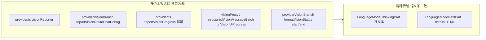
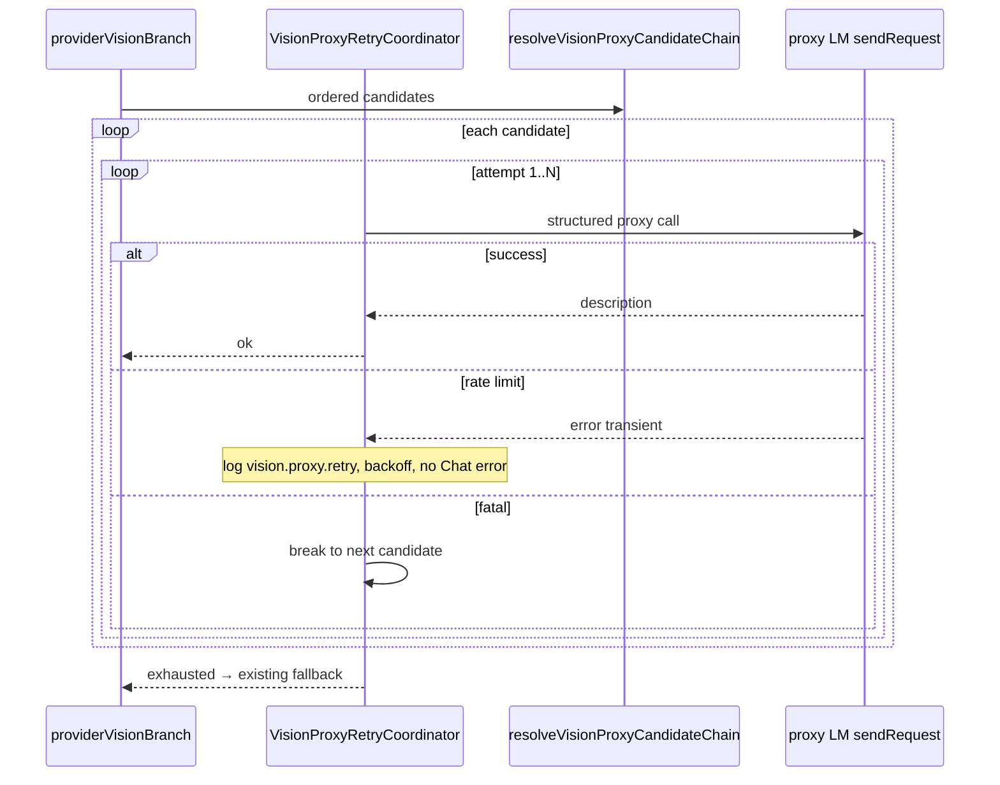
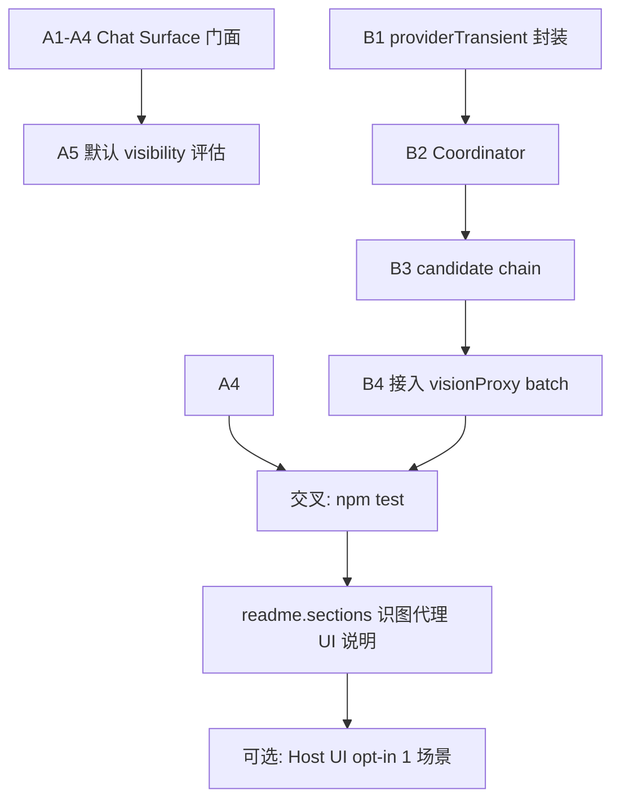

# 识图 Chat 呈现统一化 + 视觉代理重试计划

> **范围**：本计划仅覆盖 (1) Chat 中 `[Vision]` / debug 标签未折叠问题；(2) 识图代理在限流时的重试与自定义模型列表。  
> **不覆盖**：native 结构化 pass 契约变更、Host UI 默认 16 场景矩阵扩容、图像后处理链恢复。

---

## 0. 问题陈述（用户现象）

| 现象 | 用户影响 |
|------|----------|
| 多次出现 **`[Vision] start`**（及 preprocess / input / structured 等）在 Chat 中流式展开 | 干扰阅读；误以为正在「识图」；脚本/纯文本任务体验差 |
| **`[text-fallback]` / `[plan-only]` / `[Vision Debug]`** 等 debug 标签有时以明文或代码块展示 | 与「调试信息应折叠」预期不符 |
| 文件夹里虽有图片路径，但**无附件**时不应走识图（已在 `e05e093` 修复 gate） | 仍可能看到 Vision UI 噪音 → 说明 **UI 层与 gate 层未统一** |

**用户判断正确**：当前实现是 **多入口各自上报**，缺少 **唯一的 Chat 呈现策略层**；`chatDebugVisibility` 只控制「发不发」，不控制「怎么折叠」。

---

## 1. 根因分析（代码级，已复验）

### 1.1 呈现路径分裂（核心根因）



| 入口 | 文件 | 行为 | 折叠？ |
|------|------|------|--------|
| `createVisionProgressReporter().flush` | `visionProgressReporter.ts` | 有 `LanguageModelThinkingPart` 时 **直接** `thinkingPart(displayText)`，**不**走 `renderVisionThinkingDetails()` | ❌ 常外露 |
| 无 ThinkingPart 时 | 同上 | `LanguageModelTextPart(renderVisionThinkingDetails(...))` 含 `data-extended-models-vision` | ✅ |
| `reportVisionRouteChatDebug` | `providerVisionBranch.ts` | ThinkingPart 或 `` ```[Vision Debug] `` 代码块 | ❌ 代码块常展开 |
| `reportVisionProgress` | `provider.ts` | 绕过 reporter 批处理，单次 flush | ❌ 易重复块 |
| `formatVisionStructuredThinkingBlock` | `outputSemantics.ts` | 首行 `[Vision] structured evidence` **在** `<details>` **外** | ❌ 标题行外露 |
| `createVisionPreprocessSummary` 等 | `outputSemantics.ts` | 经 `appendProgress` 进入上述分支 | 取决于 transport |

**结论**：不是「折叠逻辑写错一处」，而是 **未规定唯一的「用户可见呈现契约」**，且 **ThinkingPart 与 TextPart+details 双轨策略** 导致在 Copilot Chat（普遍有 ThinkingPart）下默认 **裸显 `[Vision]` 前缀**。

### 1.2 与 `chatDebugVisibility` 的关系

- `visionProcessing.chatDebugVisibility`（默认需查 settings 默认值）为 `true` 时：**所有** 上述路径都会向 Chat `progress.report`。
- 该开关 **不应** 决定折叠方式；当前却等价于「把内部日志贴进 Chat」。
- **日志侧**已有 `logger.info('vision.route.selected')` 等；Chat 再贴一遍 = 重复 + 外露。

### 1.3 识图是否被错误执行（与 UI 噪音区分）

| 场景 | 是否调用识图 API | 证据 |
|------|------------------|------|
| 仅文本含 `image_001.png` 路径（无附件） | **否** | `vision.proxy.skipped` / 不进入 `visionNeeded`（`e05e093` 后） |
| 有真实 `LanguageModelDataPart` 图片 | **是** | `vision.proxy.structured` / `vision.native.structured` |
| 仅 `[Vision] start` 噪音、无 structured 日志 | **否** | 仅 UI 路径进入 proxy 分支后又 `not-needed` / skipped |

**本计划问题 1 聚焦**：即使 **未浪费 API**，UI 仍可能误导用户 → 必须修呈现层。

---

## 2. 修复方案 A：Chat 识图/调试呈现统一门面

### 2.1 设计目标

1. **单一门面**：`VisionChatSurface`（建议路径 `src/visionProtocol/visionChatSurface.ts`）。
2. **调用方禁止**直接 `progress.report(new ThinkingPart('[Vision]...'))` 或拼接 debug 字符串。
3. **用户可见**内容一律 **折叠**；默认 **一行摘要**；详情在 `<details>` 内。
4. **`chatDebugVisibility`**：仅控制是否向 Chat 发送；`false` 时只写 Logger。
5. **结构化 snapshot**：整段放入 **一个** `<details data-extended-models-vision-structured>`，**无**外露 `[Vision]` 标题行。

### 2.2 呈现契约（SSOT）

| 类别 | `category` 枚举 | 摘要（summary） | 正文 |
|------|-----------------|-----------------|------|
| 路由状态 | `route-status` | `识图 · start/end/failed · proxy/native` | 一行 trace（req 短 id） |
| 预处理 | `preprocess` | `识图 · 预处理` | integrity/warnings 统计 |
| 输入绑定 | `input-bound` | `识图 · 输入` | hash / source / reused |
| 结构化证据 | `structured-snapshot` | `识图 · 结构化 · N 元素` | `<pre>` JSON（上限 6k） |
| 兼容降级 | `compat-fallback` | `text-fallback / plan-only / disabled` | reason（折叠） |
| 内部调试 | `debug` | `识图 · 调试` | 仅 `chatDebugVisibility=true` |

**硬规则**：

- `LanguageModelThinkingPart`：**禁止**承载以 `[Vision]` 开头的裸文本；若必须用 ThinkingPart，则 `value` 仅为 **短摘要**（≤80 字符），详情走 TextPart+details 或第二段折叠块（实现时二选一并单测锁定）。
- 推荐默认：**统一** `LanguageModelTextPart` + `renderVisionCollapsibleBlock(category, summary, body)`，与现有 `data-extended-models-vision` 对齐，避免 Copilot 对 ThinkingPart 的展开策略差异。

### 2.3 模块边界

```
visionChatSurface.ts          ← 唯一 Chat progress 出口
  ├─ uses outputSemantics.ts  ← 纯 HTML/摘要格式化（无 progress.report）
  └─ uses visionProgressReporter.ts ← 批处理 flush 策略（改为调用 surface）

provider.ts / providerVisionBranch.ts / visionProxy.ts / structuredVisionMessageBatch.ts
  └─ 只调用 surface.append* / surface.flush
```

**删除/收敛**：

- `reportVisionRouteChatDebug` → 并入 `surface.emitDebug`。
- `reportVisionProgress` → 标记删除，调用改为 `surface.emitRouteStatus`。
- `VisionRouteReporter.appendProgress` → 类型改为 `VisionChatSurface` 或适配器。

### 2.4 实施步骤（建议顺序）

| 步骤 | 内容 | 风险 |
|------|------|------|
| A1 | 新增 `visionChatSurface.ts` + 单测快照（各 category HTML） | 低 |
| A2 | 改 `visionProgressReporter.flush` 委托 surface | 中 |
| A3 | 改 `providerVisionBranch` 所有 `appendProgress` / `reportVisionRouteChatDebug` | 中 |
| A4 | 改 `formatVisionStructuredThinkingBlock`：标题进 summary，JSON 仅 details 内 | 低 |
| A5 | 默认 `chatDebugVisibility: false`（若当前为 true 则评估 BREAKING；可在 UI 文案强调） | 产品 |
| A6 | Host UI：`extensionSmokeActivation` 中断言 **无** 裸 `[Vision] start` 字符串于 ThinkingPart（允许 summary 内「识图」） | 低 |

### 2.5 测试与交叉验证（问题 1）

#### 单元测试（必跑，`npm test`）

| 用例 ID | 断言 |
|---------|------|
| VUI-01 | `renderVisionCollapsibleBlock('route-status', ...)` 含 `data-extended-models-vision`，且 **不含** 顶层裸行 `[Vision] start` |
| VUI-02 | `flush` 批处理 3 条 append → **1** 次 `progress.report` |
| VUI-03 | `chatDebugVisibility=false` → `report` 调用次数 0，logger 调用 ≥1 |
| VUI-04 | `structured-snapshot` 大 JSON 截断 6k，HTML 转义 |
| VUI-05 | 迁移前后 `formatVisionStatusText` 日志格式不变（仅 Chat 变） |

#### 日志契约（低成本交叉）

- 现有 `vision.route.selected` / `vision.proxy.skipped` **不变**。
- 新增可选 debug：`vision.chat.surface.flush` `{ category, visible, usedThinkingPart }`（仅 debug 级别）。

#### 实机 / Host UI（opt-in，节省开支）

| 命令 | 何时跑 |
|------|--------|
| `npm test` | 每 PR |
| `npm run test:host-ui:chat-acceptance` | 合并前 1 次（**不**新增默认场景） |
| 手工：开 `chatDebugVisibility` 跑 1 次带截图场景 | 发版前 |

#### 多轮一致性

- 同一 workspace 连续 3 次 `npm test` 结果一致。
- Host UI summary `host-ui-smoke-summary.json` 仍为 `passed`；若 smoke 检测 `[Vision]` 字符串，更新为检测 **折叠标记** 而非前缀。

---

## 3. 修复方案 B：视觉代理重试 + 自定义模型列表

### 3.1 需求摘要

| 模式 | 配置 | 与自动选择关系 |
|------|------|----------------|
| **自动** | `defaultModelId` 空 + `enabled` | 保持现有 Copilot/扩展自动挑选 |
| **固定模型** | 全局或模型级指定单一 `modelId` | 与自动 **互斥** |
| **自定义列表** | 有序 `string[]`（至少 1 项） | 与自动 **互斥**；UI 可选、排序、移除 |

**运行时**：

1. 代理模型 **限流/瞬时失败** → **不向用户抛显式 Provider 错误**；同模型退避重试直至成功或达上限。
2. 同模型彻底失败 → 切列表 **下一** 模型。
3. 列表耗尽 → 走 **现有** 流程：`vision.proxy.skipped` / `unavailable` / `handleVisionStrategyFallback` / `replaceImagesWithText`。
4. **固定单模型** 模式复用 **同一** 重试协调器（列表长度 = 1）。

### 3.2 限流/可重试判定（供应商无关）

**SSOT**：复用并扩展 `src/providerTransientErrors.ts`（不新建第二套错误语义）。

| 信号 | 判定为「可重试、且不应 surfaced 给用户」 |
|------|------------------------------------------|
| HTTP 429 / 503 / 502 / 504 | ✅ `inferHttpRetryable` |
| Zhipu `1302/1305/1308/1312` | ✅ 已有 |
| OpenAI-compat `error.type`：`engine_overloaded`, `rate_limit_exceeded`, `overloaded`, `slow_down` | ✅ 已有 |
| 文案：`too many requests`, `访问量过大`, `rate limit` | ✅ 已有 |
| 401/403/余额/模型不存在 | ❌ _fatal → 立即切换模型或走现有失败 |
| 格式环 `vision.proxy.format.invalid` | ❌ 交给 structured pass 既有逻辑，**不** 计入代理模型切换 |

新增导出（建议）：

```typescript
export function isVisionProxyRateLimitFailure(error: unknown): boolean;
export function isVisionProxyFatalFailure(error: unknown): boolean;
```

实现为 `isTransientProviderFailure && !isFatalProviderFailure` 的薄封装，并单测覆盖各供应商 JSON 样本。

### 3.3 配置模型（`types.ts` + `package.json` schema）

```typescript
export type VisionProxyModelSelectionMode = "auto" | "fixed" | "custom-list";

export interface VisionProxySettings {
  enabled: boolean;
  selectionMode: VisionProxyModelSelectionMode;
  defaultModelId: string;           // fixed 模式使用；auto 时为空
  customModelIds: readonly string[]; // custom-list；≥1；有序
  customListMaxRetriesPerModel: number; // 默认 3
  customListMaxDelayMs: number;         // 默认 60000，与 executeWithRetry 对齐
  customPrompt: string;
}

// 模型级 visionProxyModelId 扩展语义：
// "" → 继承全局 mode
// "__vision_proxy_disabled__" → 禁用
// 单 id → 继承全局 mode=fixed 时覆盖为 fixed
// 未来可选：model.visionProxyCustomModelIds 覆盖全局列表（仅当 global mode=custom-list）
```

**互斥规则（写入 `resolveVisionProxyPolicy`）**：

- `selectionMode === "auto"` ⇒ 忽略 `customModelIds`，`defaultModelId` 必须为空。
- `selectionMode === "fixed"` ⇒ `defaultModelId` 必填，忽略 `customModelIds`。
- `selectionMode === "custom-list"` ⇒ `customModelIds.length >= 1`，忽略自动挑选；`defaultModelId` 清空。

### 3.4 运行时：`VisionProxyRetryCoordinator`

**建议路径**：`src/visionProxyRetryCoordinator.ts`（**不** 塞进 `visionProxy.ts` 主体，保持文件 <400 行）。



**职责**：

- 输入：`readonly ProxyCandidate[]`（resolved `vscode.LanguageModelChat` + `modelId` 标签）、`RetrySettings`、logger、cancellation。
- 输出：`{ ok, description?, lastError?, usedModelId?, attempts }`。
- 包装点：`resolveStructuredProxyDescription` 调用处（`structuredVisionMessageBatch` / `visionProxy` 单点注入），**不** 在 `provider.ts` 扩散。

**用户可见错误策略**：

- `isVisionProxyRateLimitFailure` → **仅** logger `vision.proxy.retry`；**禁止** `progress.report(ProviderError...)`。
- 列表耗尽 → 沿用 `errorMessages.visionProxyUnavailable` 文本替换图片（现有行为）。

### 3.5 配置面板 UI（`configPanel.ts`）

**全局「识图代理基础配置」区块**：

1. **选择模式** 下拉：`自动选择` | `指定模型` | `自定义列表`（与 `selectionMode` 绑定）。
2. `指定模型` → 显示现有 `visionProxyDefault` 单选下拉。
3. `自定义列表` → 显示列表编辑器：
   - 行：拖拽把手（可选 v1 用 ↑↓）、模型下拉、`×` 移除。
   - 底部：`+ 添加模型`；至少保留 1 行；保存时校验。
   - **对齐**：与上方 `visionProxyDefault` 同宽；`+` / `×` 右对齐或表格式，复用现有 config panel 按钮 class。
4. **模型级「视觉代理」** 下拉增加一项：`使用全局自定义列表`（仅 global mode=custom-list 时可选）或 `自定义列表（覆盖）`（v2 可选，v1 可仅继承全局）。

**持久化**：`saveVisionProxyBase` 扩展 payload `{ enabled, selectionMode, defaultModelId, customModelIds }`。

### 3.6 候选链解析（`selectVisionProxyModel` 演进）

新增 `resolveVisionProxyCandidateChain(model, settings, logger): Promise<readonly ProxyCandidate[]>`：

| mode | 链构建 |
|------|--------|
| auto | 现有 `selectVisionProxyModel` 逻辑，返回 1 个或 0 个 |
| fixed | 单候选 |
| custom-list | 按 `customModelIds` 顺序解析；跳过 self-id、不可用项并 `vision.proxy.candidate.skip` 日志 |

**与自动选择互斥**：custom-list 模式 **不** 调用 Copilot auto vision 回退（除非列表全部不可用，则走现有 unavailable）。

### 3.7 测试与交叉验证（问题 2）

#### 单元测试（必跑）

| 用例 ID | 内容 |
|---------|------|
| VPR-01 | `isVisionProxyRateLimitFailure`：Zhipu 1305 / OpenAI 429 / Moonshot engine_overloaded 样本 |
| VPR-02 | fatal：401、1113、model not exist → 不重试或立即切换 |
| VPR-03 | Coordinator：mock fn 前 2 次 429 第 3 次成功 → attempts=3，无 throw |
| VPR-04 | Coordinator：单模型 3 次均 429 → 返回 exhausted，**无** `User-facing ProviderError` |
| VPR-05 | Coordinator：列表 [A,B]，A fatal、B 成功 → usedModelId=B |
| VPR-06 | `resolveVisionProxyPolicy`：三种 mode 互斥校验 |
| VPR-07 | config 序列化/反序列化 `customModelIds` 顺序保持 |

#### 集成（mock LM，`npm test`）

- 扩展 `visionProxy.test.ts` 或新增 `visionProxyRetryCoordinator.test.ts`：注入 fake `sendRequest` 抛 `createHttpError(429,...)`。

#### 日志契约（Host UI / 手工 opt-in）

| Marker | 含义 |
|--------|------|
| `vision.proxy.retry` | `{ modelId, attempt, delayMs, code }` |
| `vision.proxy.model-switch` | `{ from, to, reason }` |
| `vision.proxy.candidate.skip` | `{ modelId, reason }` |

**不** 新增默认 Host UI 场景（节省 11min+ 实机）。

#### 多轮一致性

- 带缓存场景：`vision.proxy.cache.hit` 仍出现；重试 **不** 破坏 cache key（同一 `proxyModelId` 成功后才写入 cache）。
- 连续 3 次 `npm test` + `catalog:verify` 无漂移。

#### 实机抽检（发版前 1 次，可选）

- 环境变量 `COPILOT_BRO_UI_SMOKE_PROXY_RETRY=1` 启用 **单个** 探针场景（新建 opt-in，**不进** DEFAULT 16）。
- 或手工：临时把 custom list 设为易限流模型，观察 Chat **无** 红色 Provider 报错，Output 有 retry 日志。

---

## 4. 实施顺序与依赖



**推荐 PR 拆分**：

1. **PR1**：`VisionChatSurface` + 呈现修复（问题 1）— 无配置变更。
2. **PR2**：`VisionProxyRetryCoordinator` + settings schema + config panel（问题 2）。
3. **PR3**（可选）：README/`docs/vision-route-order.md` 更新。

---

## 5. 验收清单（Definition of Done）

- [ ] Chat 中 **无** Repeated 裸 `[Vision] start` 行（`chatDebugVisibility=true` 时仍为折叠块）。
- [ ] `reportVisionRouteChatDebug` / 裸 `ThinkingPart('[Vision]...')` **零** 直接调用（grep 门禁可加在 `planCoverageAudit` 或 eslint 局部脚本）。
- [ ] 自定义列表 UI：±× 对齐、至少 1 模型、与 auto/fixed 互斥。
- [ ] 限流时：Output 有 retry 日志，Chat **无** Provider API error 气泡。
- [ ] 列表耗尽：行为与当前 `vision.proxy.unavailable` / fallback **一致**。
- [ ] `npm test` 全绿；`npm run verify:ci` 全绿；Host UI 默认 16 场景仍 pass。
- [ ] CHANGELOG + `npm run readme:generate` 更新（合并时）。

---

## 6. 风险与回滚

| 风险 | 缓解 |
|------|------|
| Copilot 不渲染 `<details>` | 保留 summary 一行；依赖 Host UI smoke 快照；必要时仅发 ThinkingPart 短摘要 |
| custom-list 与模型级 `visionProxyModelId` 语义冲突 | v1 文档写清：模型级仅 fixed/disabled/继承；列表仅全局 |
| 重试掩盖真实配置错误 | fatal 类立即切换或失败，不重试 |
| 测试成本上升 | 默认 0 新实机场景；retry 探针 opt-in |

**回滚**：`selectionMode` 默认 `auto`；`VisionChatSurface` 可 feature-flag `visionProcessing.useUnifiedChatSurface`（默认 true，异常时 false 恢复旧 reporter）。

---

## 7. 参考文件索引

| 主题 | 路径 |
|------|------|
| 呈现 / 折叠 | `src/toolCooperation/visionProgressReporter.ts`, `outputSemantics.ts` |
| 上报入口 | `src/provider.ts`, `src/providerVisionBranch.ts` |
| 代理解析 | `src/visionProxy.ts`, `src/visionProxyPolicy.ts`, `src/visionProxyModelSelection.ts` |
| 结构化 batch | `src/visionProtocol/structuredVisionMessageBatch.ts` |
| 瞬态错误 | `src/providerTransientErrors.ts` |
| HTTP 重试 | `src/visionStructuredRetryPolicy.ts`, `openaiCompat/client.ts` |
| 配置 UI | `src/ui/configPanel.ts`, `package.json` `extendedModels.visionProxy` |
| 主计划 | `plan/VISION_FLOW_MASTER.plan.md` |
